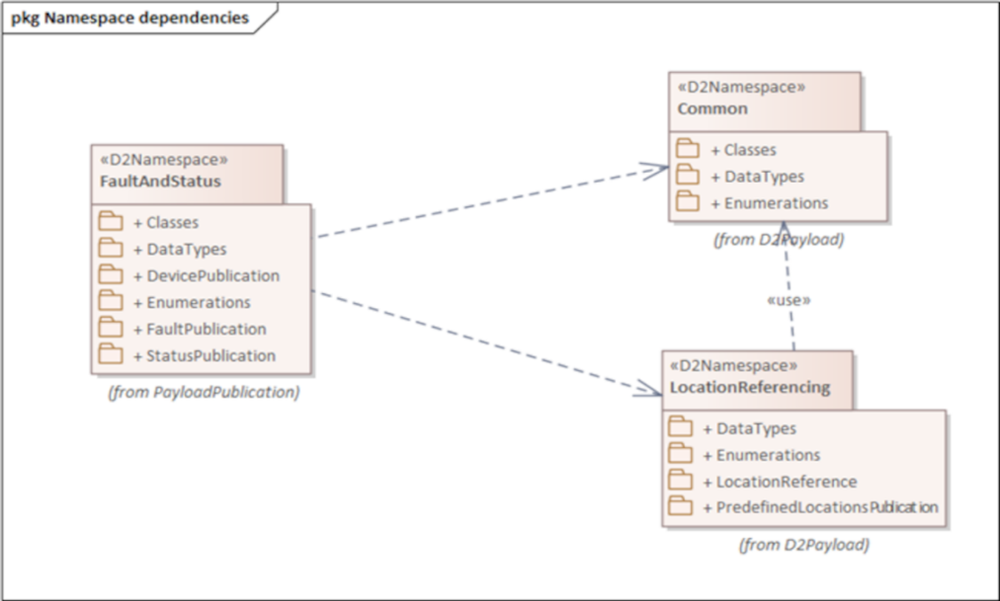
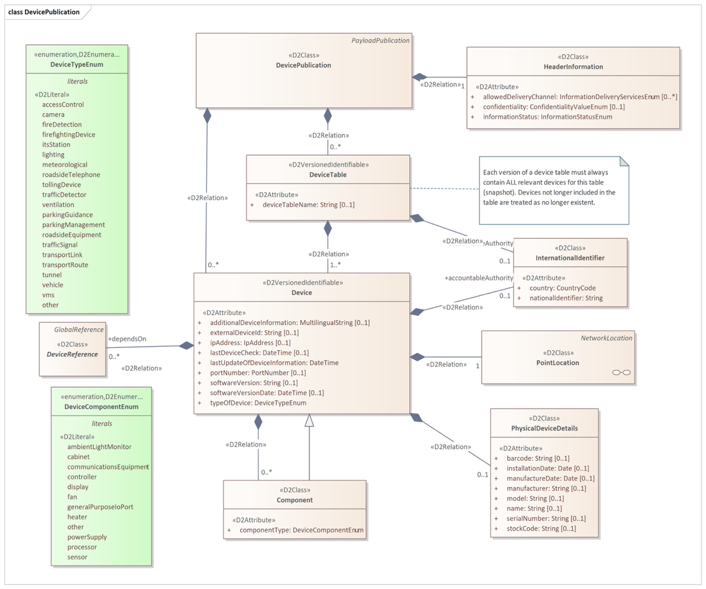

## Introduction

CEN/TS 16157-13 (hereinafter "the described document") is part of the CEN 16157 (DATEX II) series of standards (hereinafter "the series").

This series addresses data exchange in road traffic. It defines principles for creating message models, specifies the data content itself, data structures and their mutual relationships. It covers messages about road traffic (accidents, planned and unplanned roadworks, travel times, information on variable message signs, etc.).

The series establishes specifications for data exchange between any two instances of actors such as traffic information centres (TIC), traffic control centres (TCC), service providers (SP), and others.

The described document supersedes CEN/TS 17241:2019.

*Note: This Extract presents selected chapters of the described document and retains the original chapter numbering.*

## Usage

The described document specifies provision of information on the status and faults of components of traffic management systems using the standardised DATEX II format.

The described document will therefore be useful when designing and implementing solutions that allow uniform reporting on the status of devices in traffic management systems — for analysts and developers (designing and developing the system), for data consumers (receiving and interpreting the information), and for procurers (using it in technical specifications).

The data model covers three aspects: an inventory of devices (what devices exist and where they are), the current operational health and ability to provide services, and fault records describing what is wrong. The scope is always description only — not control of devices.

Usability assessment: The document is well-structured and relatively compact at 68 pages. Its main value lies in providing a standardised, DATEX II-compatible vocabulary and class model for device health reporting, directly applicable in ITS infrastructure projects in Europe. Practical implementation requires familiarity with the broader DATEX II ecosystem (EN 16157-1, -2, -7). The XML Schema in Annex B is immediately usable for validation.

## Scope

This document specifies a data model for the status and faults of components of traffic management systems.

The data model is intended for use in system-to-system data exchanges for device status and fault management purposes.

It describes three aspects of monitored devices:

— their inventory (description of the devices themselves including their location);

— the current operational status and ability to provide services;

— information on faults and defects affecting device functionality.

The scope covers description only — not the actual control of these devices.

## Related Documents (Selection)

This clause presents a selection of the most important related documents, from both the Normative references and the Bibliography of the described document.

The described document uses several standards from the DATEX II series, in particular:

EN 16157-1:2018, Part 1: Context and framework; EN 16157-2:2019, Part 2: Location referencing; EN 16157-7:2018, Part 7: Common data elements

The model also allows referencing of instances from publications in other parts of the series, e.g. VmsController (EN 16157-4) or MeasurementSite (EN 16157-5).

Some parts of the model reference devices in an external catalogue using an ASN.1 object identifier (dot notation) according to: ISO/IEC 8824-1, ISO/IEC 9834-1.

The described document also builds on class models published at http://www.datex2.eu, which, while not normative, are technically and methodologically a fundamental source of information.

## Terms and Definitions

The clause contains the following 3 terms and definitions relevant to this standard:

**device** — logical object, realised by physical equipment, at a known location, that is desired to deliver a service

*NOTE 1 to entry: The definition does not apply in the context of the term "physical device".*

*NOTE 2 to entry: In the context of this document a device is a logical object which could be realised by different physical objects at different points in time, for example if a faulty item is replaced by a spare of the same type.*

**status** — ability of a device or system to perform its functions at a given point in time in terms of its own technical condition, external operational configuration and the state of all underlying support systems

**fault** — a failure or deficiency in a device or system that signifies a potential or actual change in status resulting in reduced ability to perform functions

## Abbreviations

The clause contains 2 abbreviations relevant to this standard, to which we also add OID:

**UML** Unified Modeling Language

**XML** eXtensible Markup Language

**OID** Object Identifier

*NOTE: Other terms and abbreviations from the ITS domain can be found in the ITSTerminology dictionary (), the StandardLand website () or the OBP platform ().*

## 6 The FaultAndStatus namespace

This clause describes, over 9 pages using 6 sub-clauses, the model of the <<D2Namespace>> FaultAndStatus namespace with namespace prefix “fst”.

### 6.1 Overview of the FaultAndStatus namespace

This sub-clause (1 page) provides a basic overview of the dependencies of the FaultAndStatus namespace with related namespaces (e.g. the Common package and LocationReferencing namespace, see Figure 1).

**Figure 1 — Namespace dependencies of the FaultAndStatus namespace (Fig. 1 of the source standard)**

The FaultAndStatus namespace contains the following sub-packages:

— “Classes” package, defining classes that may be used in other sub-packages,

— “DataTypes” package, defining new datatypes,

— “DevicePublication”, defining the structure of device publications,

— “Enumerations”, defining enumerated types,

— “FaultPublication”, defining the structure of device fault publications,

— “StatusPublication”, defining the structure of device status publications.

### 6.2 Device publication

This sub-clause (2 pages, 1 diagram) defines the DevicePublication class, enabling description of device inventory (static publication, see Figure 2). The DevicePublication constructs are designed for use when no more specific kind of device publication (such as a VmsPublication as defined in EN 16157-4) is needed.

**Figure 2 — DevicePublication class (Fig. 2 of the source standard)**

A DevicePublication contains information on a collection of devices, either directly or via one or more DeviceTable objects. A single DevicePublication object should contain either DeviceTable objects or Device objects directly, not both.

A Device object contains static (or infrequently changing) information about a logical device that delivers a service. The class Device is <<D2VersionedIdentifiable>>, which allows device objects to be referenced in fault and status publications. A Device object may identify one or more other Devices upon which it depends to deliver its service, and may provide one or more Component objects describing components of the device.

A PhysicalDeviceDetails object contains information specific to the physical device that realises a logical device service (manufacturer, model, serial number, installation date, etc.).

### 6.3 Device status publication

This sub-clause describes, over three pages with the aid of two figures, the StatusPublication class, enabling description of the status of a set of devices defined in static publications.

A StatusPublication contains information on the status of one or more devices. It may do this either by providing one or more Status objects directly or by providing a collection of status for whole device tables using the StatusOfAllDevicesFromTable class.

A Status object holds dynamic information on the status of a device. It shall include at least a classification of health (ability to provide the service) selected from DeviceHealthEnum, the date and time of the last status update, and a reference to the associated device via a DeviceReference object. It may optionally carry an OperationalState object, one or more DevicePower objects, and references to related faults.

OperationalState concerns the operational state into which a device has been placed (e.g. maintenanceMode, off, on, powerSafeMode, specialMode, temporarilyDeactivated, permanentlyDeactivated), which is distinct from device health. DevicePower provides a classification of the health of the power source for a Device, for a specified kind of power source.

### 6.4 Device faults publication

This sub-clause describes, over two pages with the aid of two diagrams, the FaultPublication class, enabling description of device faults.

A FaultPublication contains information on faults of one or more devices. It may do this either by providing fault information for a whole DeviceTable, or directly for one or more individual devices. In both cases the fault information is provided via the AllFaultsOfSingleDevice class.

An AllFaultsOfSingleDevice object provides a snapshot of all current fault information for the single device identified via an associated DeviceReference object. It may contain zero or more DeviceFault objects.

A DeviceFault object describes a single fault of a single Device. DeviceFault inherits the properties of the Fault class defined in EN 16157-7. In addition a DeviceFault object shall indicate the type of fault selected from FaultTypeEnum in Annex A. It may also provide information on the impact on data, the affected component, and instructions on how the fault can be rectified. A DeviceFault object may also link to a fault information entry in an external catalogue.

### 6.5 Classes

This sub-clause describes, over 3 pages and one diagram, a set of classes that allow linking of status and fault information to devices described in other publications or in an external catalogue. These classes are: GeneralDeviceTableReference, VmsUnitTableReference, MeasurementSiteTableReference, GeneralDeviceReference, VmsUnitReference, MeasurementSiteReference, and CatalogueInformation.

DeviceTableReference and DeviceReference are abstract classes (subclasses of GlobalReference from EN 16157-7:2018). The concrete subclasses allow status and fault publications to reference devices defined not only in DevicePublications but also in other kinds of publications for more specific device types (VMS controllers, measurement sites).

CatalogueInformation objects provide links to other information using an ASN.1 object identifier (conforming to ISO/IEC 8824-1 and ISO/IEC 9834-1) rather than the DATEX II referencing mechanism.

### 6.6 DataTypes

This sub-clause describes, using one diagram and one paragraph of text, the ObjectIdentifier data type, used for references to other devices using the dot notation defined in ISO/IEC 9834-1 and ISO/IEC 8824-1. ObjectIdentifier is a specialisation of the String datatype defined in EN 16157-7:2018.

## Annex A (normative) Data Dictionary

This annex (18 pages, 25 tables) provides a data dictionary identifying the definitions and characteristics of all classes, attributes, association ends, data types and enumerations appearing in the data model defined in Clause 6. Among other things it defines enumerated values for device types (Table 1 below) and enumerated values for the impact of a device fault on provided data (Table 2 below).

**Table 1 — Values contained in the enumeration “DeviceTypeEnum” (Tab. A.18 of the source standard)**

<table>
  <tr>
    <th>Enumerated value name</th>
    <th>Designation</th>
    <th>Definition</th>
  </tr>
  <tr>
    <td>accessControl</td>
    <td>Access control</td>
    <td>Access control equipment</td>
  </tr>
  <tr>
    <td>camera</td>
    <td>Camera</td>
    <td>Camera</td>
  </tr>
  <tr>
    <td>fireDetection</td>
    <td>Fire detection</td>
    <td>Fire detection device</td>
  </tr>
  <tr>
    <td>firefightingDevice</td>
    <td>Firefighting device</td>
    <td>Firefighting device such as a sprinkler system</td>
  </tr>
  <tr>
    <td>itsStation</td>
    <td>Its station</td>
    <td>An ITS station unit as defined in ISO 21217</td>
  </tr>
  <tr>
    <td>lighting</td>
    <td>Lighting</td>
    <td>Illumination device</td>
  </tr>
  <tr>
    <td>meteorological</td>
    <td>Meteorological</td>
    <td>Meteorological equipment</td>
  </tr>
  <tr>
    <td>other</td>
    <td>Other</td>
    <td>Some other device</td>
  </tr>
  <tr>
    <td>parkingGuidance</td>
    <td>Parking guidance</td>
    <td>A device offering parking guidance</td>
  </tr>
  <tr>
    <td>parkingManagement</td>
    <td>Parking management</td>
    <td>A device involved in parking management</td>
  </tr>
  <tr>
    <td>roadsideEquipment</td>
    <td>Roadside equipment</td>
    <td>Roadside equipment</td>
  </tr>
  <tr>
    <td>roadsideTelephone</td>
    <td>Roadside telephone</td>
    <td>Roadside emergency telephone</td>
  </tr>
  <tr>
    <td>tollingDevice</td>
    <td>Tolling device</td>
    <td>Device used for road tolling</td>
  </tr>
  <tr>
    <td>trafficDetector</td>
    <td>Traffic detector</td>
    <td>A device that detects vehicles</td>
  </tr>
  <tr>
    <td>trafficSignal</td>
    <td>Traffic signal</td>
    <td>A traffic signal (controller and potentially multiple traffic lights)</td>
  </tr>
  <tr>
    <td>transportLink</td>
    <td>Transport link</td>
    <td>An instrumented transport link, considered as a single data service</td>
  </tr>
  <tr>
    <td>transportRoute</td>
    <td>Transport route</td>
    <td>An instrumented transport route, considered as a single data service</td>
  </tr>
  <tr>
    <td>tunnel</td>
    <td>Tunnel</td>
    <td>A tunnel device</td>
  </tr>
  <tr>
    <td>vehicle</td>
    <td>Vehicle</td>
    <td>A vehicle in its role as a connected communicating device</td>
  </tr>
  <tr>
    <td>ventilation</td>
    <td>Ventilation</td>
    <td>Ventilation device</td>
  </tr>
  <tr>
    <td>vms</td>
    <td>Vms</td>
    <td>A variable message sign</td>
  </tr>
</table>

**Table 2 — Values contained in the enumeration “FaultImpactOnDataEnum” 
(Tab. A.19 of the source standard)**

<table>
  <tr>
    <th>Enumerated value name</th>
    <th>Designation</th>
    <th>Definition</th>
  </tr>
  <tr>
    <td>downloadFailed</td>
    <td>Download failed</td>
    <td>A download failed.</td>
  </tr>
  <tr>
    <td>intermittentData</td>
    <td>Intermittent data</td>
    <td>Data is transmitted intermittently, i.e. not continuously.</td>
  </tr>
  <tr>
    <td>noData</td>
    <td>No data</td>
    <td>There is no data transmitted.</td>
  </tr>
  <tr>
    <td>unreliableData</td>
    <td>Unreliable data</td>
    <td>The data is unreliable.</td>
  </tr>
  <tr>
    <td>unspecified</td>
    <td>Unspecified</td>
    <td>The impact on data of the fault is not specified.</td>
  </tr>
</table>

## Annex B (normative) XML Schema

This annex contains one extensive W3C XML Schema that is derived from the class model defined by this document. The schema shall be used when using an XML encoding. It is the result of applying the UML-to-XML Schema mapping defined in EN 16157-1:2018. This schema may be extended in a manner conformant to EN 16157-1:2018.

Supplied data claiming conformance to this document shall positively validate against the schema specified in this annex, including any permissible extensions.

## Annex C (normative) Additional common datatypes

This annex introduces, over nearly two pages and using one diagram, two new data types PortNumber and IpAddress and determines their mapping to the W3C XML Schema. These datatypes are placed in the CommonExtension namespace and are used to identify IP addresses and port numbers associated with devices.
