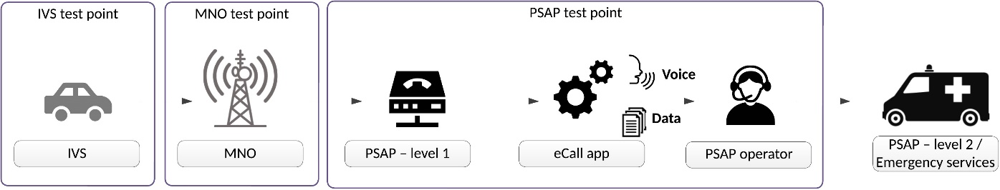

## Introduction

eCall is an emergency call triggered automatically by vehicle sensors or manually by the crew, which, via the mobile network, sends a standardized minimum set of data to the most appropriate Public Safety Answering Point (PSAP) containing information about the accident and the vehicle’s location, while simultaneously establishing a voice connection with the crew. European standards define the data structure, application protocols, and operational requirements of eCall for both traditional circuit-switched networks and modern packet-switched IP-based networks (e.g., LTE, 5G, and IMS), which are gradually replacing them. Due to the transitional period of coexistence between both network types, standards and conformity tests have also been developed for hybrid environments to ensure reliable and interoperable pan-European operation of eCall.

*Note: This Extract presents selected chapters of the described document and retains the original chapter numbering.*

## Usage

The document described is an important reference for the certification of individual components of the eCall system. In this context, it is significant for certification authorities and testing laboratories. Furthermore, it enables eCall solution and product providers to issue declarations of conformity independently of other elements within the overall eCall chain.

## Scope

The described document approaches conformity testing in a manner analogous to existing eCall conformance testing standards. This applies from the perspective of the following key actors:

- In-Vehicle System (IVS)

- Mobile Network Operator (MNO)

- Public Safety Answering Point (PSAP)

Together with EN 16454 and EN 17240, the described document completes the set of documents for testing the conformity of all eCall components in various environments.

The scope of the document covers conformity testing of eCall technologies, products, and systems. The testing is intended for type approval of devices, rather than for verifying specific installations of units in vehicles.

## Related Documents (Selection)

The clause contains references to eight related standards. The most relevant include:

- EN 17905:2023, Intelligent transport systems — eSafety — eCall HLAP in hybrid circuit switched/packet switched network environments

- prEN 17240, Intelligent transport systems — ESafety — ECall end to end conformance testing for IMS packet switched based systems

- EN 16454, Intelligent transport systems — ESafety — ECall end to end conformance testing

## 3 Terms and Definitions

Clause 3 contains 27 definitions provided in full in the standard. In this extract, the following terms and definitions appear in particular:

**eCall** – emergency call generated either automatically via activation of in-vehicle sensors or manually by the vehicle occupants, which, when activated, provides notification and relevant location information to the most appropriate Public Safety Answering Point, by means of mobile wireless communications networks, carries a defined standardized Minimum Set of Data (MSD) notifying that there has been an incident that requires response from the emergency services, and establishes an audio channel between the occupants of the vehicle and the most appropriate Public Safety Answering Point

**public safety answering point (PSAP)** – physical location working on behalf of the national authorities where emergency calls are first received under the responsibility of a public authority or a private organization recognized by the national government

**minimum set of data (MSD)** – standardized data concept comprising data elements of relevant vehicle generated data essential for the performance of the eCall service

**vehicle manufacturer** – entity which first assembles the vehicle and provides eCall equipment as part of its specification and subsequently sells the vehicle directly or via an agent

## 4 Abbreviations

Clause 4 contains 43 symbols and abbreviations. In this extract, the following appear in particular:

<table>
  <tr>
    <th>CS</th>
    <th>Circuit Switched</th>
  </tr>
  <tr>
    <td>CTP</td>
    <td>Conformance Test Procedure</td>
  </tr>
  <tr>
    <td>IMS</td>
    <td>IP-Multimedia Subsystem</td>
  </tr>
  <tr>
    <td>IVS</td>
    <td>In-Vehicle System</td>
  </tr>
  <tr>
    <td>LTE</td>
    <td>Long Term Evolution</td>
  </tr>
  <tr>
    <td>MNO</td>
    <td>Mobile Network Operator</td>
  </tr>
  <tr>
    <td>PS</td>
    <td>Packet Switched</td>
  </tr>
  <tr>
    <td>PSAP</td>
    <td>Public Safety Answering Point</td>
  </tr>
</table>

Other terms and abbreviations from the ITS domain can be found in the *ITSTerminology* dictionary ([www.itsterminology.org](http://www.itsterminology.org)), the *StandardLand* website ([www.standardland.cz](http://www.standardland.cz)) or the *OBP platform* ([www.iso.org/obp](http://www.iso.org/obp)).

## 5 Conformity with this Standard

The document described is intended to assess the conformity of the eCall system implementation at the level of the individual key actors in the eCall chain defined above. If a supplier declares conformity of their products with this document, they may do so only if they can demonstrate that all test procedures relevant to their product or service have been successfully completed.

## 6 General Description of the European eCall Transaction

Starting with this clause (covering 4 pages including figures and tables), the document presents the substantive content of the standard. Clause 6 provides a summarized description of the eCall transaction, including a state diagram. References to the related normative documents are provided. The clause also outlines the differences between eCall transactions carried out over circuit-switched and packet-switched networks. Additionally, it contains an overview table with the eCall call phases, including descriptions and abbreviations used throughout the document.

## 7 How to Use the Standard

This clause (approximately 1.5 pages of text) explains how to work with the standard. At a more general level, it defines the criteria for test success and clarifies the focus of the conformity testing procedures.

## 8 Requirements

This clause (covering 11 pages including figures and diagrams) summarizes the key requirements for performing conformity testing. Essentially, it presents the relationships between individual actors and identifies the interfaces that will be subject to conformity verification. It describes the naming conventions used in conformity tests and provides an overview matrix linking individual tests to eCall call phases and the type of test.

**Figure 1 – Conformity Testing Points (not part of the described document)**

## 9 Conformity Tests for In-Vehicle Systems (IVS)

This clause (covering 58 pages including diagrams and tables) specifies the requirements and parameters for conformity testing of in-vehicle systems (IVS). Within the clause, detailed descriptions of a total of 43 test scenarios are provided. Test scenarios cover:

- CTP 1.1.1.1 – Self-test and fault indication

- CTP 1.1.2.1 – Domain selection skipped in CS domain

- CTP 1.1.2.2 – Domain selection skipped in PS domain

- … and 41 other scenarios.

## 10 Conformity Tests for Mobile Network Operator Systems (MNO)

This clause (covering 9 pages including diagrams and tables) specifies the requirements and parameters for conformity testing of mobile network operators. Within the clause, detailed descriptions of a total of 6 test scenarios are provided. Test scenarios cover:

- CTP 2.1.3.1 – New/updated MSD after in-call domain handover

- CTP 2.1.3.2 – New/updated MSD after in-call domain handover – Roaming

- CTP 2.1.5.1 – Call-back after in-call domain handover

- … and 3 other scenarios.

## 11 Conformity Tests for Public Safety Answering Point Systems (PSAP)

This clause (covering 14 pages including diagrams and tables) specifies the requirements and parameters for conformity testing of PSAP systems receiving eCall calls. Within the clause, detailed descriptions of a total of 11 test scenarios are provided. Test scenarios cover:

- CTP 3.1.10.1 – Logging MSD transmission type for eCall in a circuit-switched domain

- CTP 3.1.10.2 – Logging MSD transmission type for eCall in a packet-switched domain

- … and 9 other scenarios.

## 12 Labeling, Tagging, and Packaging

This clause only presents the basic requirements related to labeling and packaging of devices depending on the (non-)fulfillment of tests.

## 13 Declarations of Patents and Intellectual Property

No patents or other intellectual property rights are claimed within this standard, except for those specified in the referenced documents.
