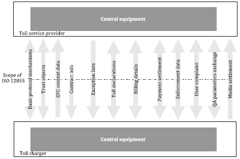
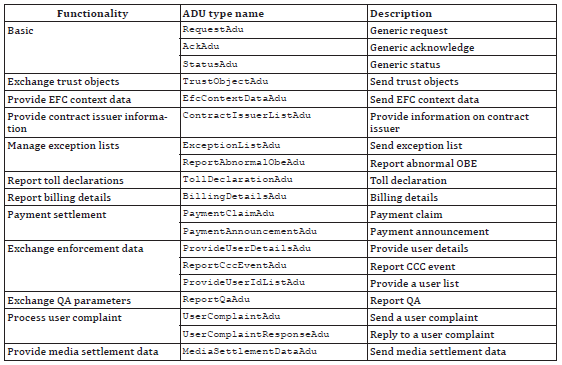
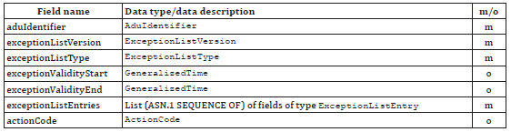
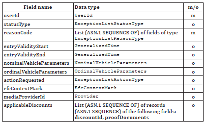

## Introduction

This technical standard (hereinafter also referred to as the “described document”) specifies the interface for the exchange of data messages between the main entities (roles) of the electronic fee collection system architecture, i.e., the toll charger and the toll service provider. It establishes the complete specification of data messages, their syntax, semantics, and the mechanism of their transmission.

Note: This Extract presents selected chapters of the described document and retains the original chapter numbering.

## Usage

The described document is intended for toll chargers and toll service providers, as it establishes the basic elements of mutual interoperability at the level of their back-end systems.

## Scope

The described document defines the exchange of information between the toll charger and the toll service provider. It describes the interface functionality, as well as the complete syntax and semantics of the data messages that can be exchanged via the interface (especially trusted objects, context data, exception lists, toll declarations, billing details, enforcement data). Furthermore, transmission mechanisms and support functions are described here.

## Related Documents (Selection)

The described document refers to 25 technical standards, the most important of which are:

ISO 14906, Electronic Fee Collection (EFC) – Application interface definition for dedicated short-range communication (DSRC)

ISO 17573-1, Electronic Fee Collection – System architecture for vehicle-related tolling – Part 1: Reference model

ISO 17573-2, Electronic Fee Collection – System architecture for vehicle-related tolling – Part 2: Terminology

## 4 Abbreviations

This clause contains 42 abbreviations related to the described document, the most important of which are the following:

ADU application data unit

DSRC dedicated short-range communications

EFC electronic fee collection system; electronic fee collection

GNSS global navigation satellite system

OBE on-board equipment

RSE roadside equipment

TC toll charger

TSP toll service provider

Other terms and abbreviations from the ITS domain can be found in the ITS Terminology dictionary (www.itsterminology.org), the StandardLand website (www.standardland.cz) or the OBP platform (www.iso.org/obp).

## 5 Architecture

This clause, spanning 9 pages, contains a basic description of the interface functionalities for the exchange of data messages between the toll charger and the toll service provider. The following functionalities are described:

- exchange of trusted objects;

- provision of context data;

- exception list management (e.g., blacklist, whitelist);

- provision of toll declarations;

- provision of billing details;

- exchange of enforcement data;

- exchange of service quality assurance data;

- provision of medium provider billing details.

*Figure 1 – Overview of functionalities (Fig. 3 of the source standard)*

## 6 Specification

This clause, spanning 121 pages, contains a description of the structure of 19 application data units (ADUs) that form the data messages transmitted via the interface. This is the pivotal clause of the described document. The ADUs listed in the table below are defined sequentially:

*Table 1 – Overview of ADUs (Tab. 5 of the source standard)*

For illustration, the definition of the ExceptionListADU data unit is provided below.

*Table 2 – Definition of ExceptionListADU (Tab. 77 of the source standard)*

Individual data types are explained sequentially in the text, or their definition is provided. For illustration, the definition of the ExceptionListEntry data type is provided below.

*Table 3 – Definition of ExceptionListEntry (Tab. 78 of the source standard)*

## 7 Transmission Mechanisms

This clause, spanning 3 pages, establishes recommendations regarding the use of a secure communication channel, data encoding, message authentication, and message signing algorithms.

## Annex A (normative) – Specification of EFC Data Types

Annex A, spanning 1 page, provides the specification of the data types used according to ASN.1. A reference is provided here to the relevant ASN files, which can be imported into other application modules.

## Annex B (informative) – Enforcement Process

Annex B, spanning 5 pages, describes the enforcement process. The process is illustrated using an activity diagram capturing the steps implemented on the side of the toll charger and the toll service provider, as well as the exchanged data messages.

## Annex C (informative) – Data Flow Example in a Toll Domain

Annex C, spanning 3 pages, describes an example of a data flow in a toll domain. The example is illustrated using a sequence diagram capturing the data exchange between the toll charger, on-board equipment (OBE), toll service provider, and user.

## Annex D (informative) – Example of Rounding

Annex D, spanning 4 pages, illustrates using the EasyGo example how rounding of amounts from aggregated toll transactions can be approached when creating billing details.

## Annex E (informative) – Example of Toll Calculation Based on Context Data

Annex E, spanning 4 pages, provides an example of toll calculation based on tariff table information, toll context information, and toll domain usage information.
