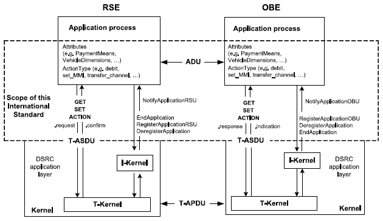
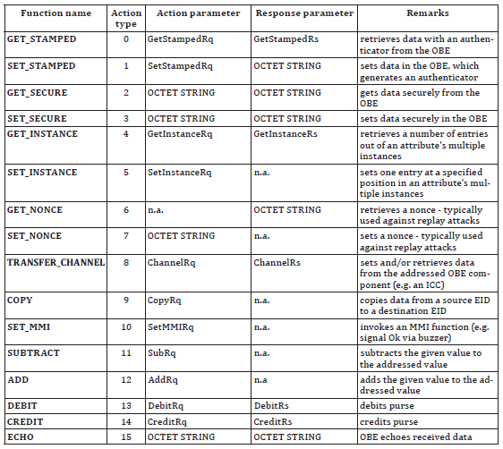
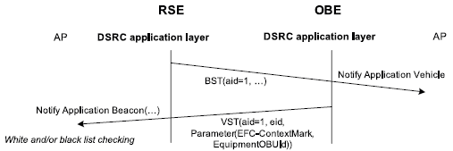
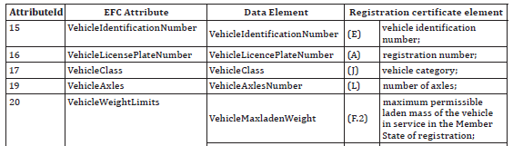

## Introduction

This technical standard (hereinafter also referred to as the "described document") specifies the application interface for electronic fee collection (EFC) systems that utilize dedicated short-range communication (DSRC). Specifically, it establishes the technical conditions for the EFC transaction model, EFC functions, and EFC data attributes from which an EFC transaction can be created in a DSRC environment.

*Note: This Extract presents selected* *chapters* *of the described document and retains the original* *chapter* *numbering.*

## Usage

The described document is intended for operators of toll systems built on DSRC technology as well as for toll service providers. The described document establishes the basic elements of mutual interoperability of electronic fee collection system components, specifically on-board equipment (OBE) and roadside equipment (RSE).

## Scope

The described document specifies the application interface for electronic fee collection systems that utilize DSRC technology. The application interface represents the interface of the EFC application process to the DSRC application layer, as illustrated in Figure 1. The document provides specifications for:

- EFC data attributes, i.e., information about the EFC application;

- procedures for addressing attributes and (hardware) EFC components (e.g., ICC and MMI);

- EFC application functions, i.e., further qualification of actions through definitions of respective services;

- the EFC transaction model defining common elements and steps of any EFC transaction;

- interface behavior to ensure interoperability at the EFC application level and the DSRC application interface;

- **Figure 1 – Scope** **of the original document (Fig.** **1 of the** **source** **standard)**

## Related Documents (Selection)

The described document refers to 12 technical standards, the most important of which are:

- ISO/IEC 9797-1, Information technology – Security techniques – Message Authentication Codes (MACs) — Part 1: Mechanisms using a block cipher

- ISO 15628, Intelligent transport systems — Dedicated Short-Range Communication (DSRC) – Application layer

## 3 Terms and Definitions

This clause contains 17 terms and definitions related to the described document, the most important of which are:

**attribute** – an addressed data packet consisting of one or a sequence of multiple data elements

**on-board** **equipment** – equipment installed in a vehicle performing the required EFC functions

**roadside** **equipment** – equipment located along the infrastructure performing the required EFC functions

**transaction** – a complete exchange of information between roadside equipment (RSE) and on-board equipment (OBE)

## 4 Abbreviations

This clause contains 35 abbreviations related to the described document, the most important of which are the following:

**DSRC** dedicated short-range communications

**EFC** electronic fee collection system; electronic fee collection

**OBE** on-board equipment

**RSE** roadside equipment

Other terms and abbreviations from the ITS domain can be found in the *ITS Terminology* dictionary (), the *StandardLand* website () or the *OBP platform* ().

## 5 DSRC Application Interface Architecture

This clause, spanning 5 pages, establishes which DSRC application interface services the electronic fee collection system recognizes, in what order it invokes them, and how it uses them to retrieve or change attributes stored in the on-board equipment. The basic services used include the functions GET, SET, ACTION, EVENT-REPORT, and INITIALISATION.

Furthermore, this clause establishes the manner in which the roadside equipment (RSE) accesses data attributes stored in the on-board equipment (OBE). A concept of namespaces is introduced here so that multiple sets of attributes can be stored separately in one on-board equipment, each for use in a different toll domain. The identification of each namespace is carried out through the EFC-ContextMark attribute.

## 6 EFC Transaction Model

This clause, spanning 5 pages, establishes the EFC transaction model consisting of two phases – initialization and transaction.

The initialization phase is based on the exchange of messages with transmitter and vehicle parameters (known as BST and VST), within which information is transmitted regarding the services, functions, and attributes supported by the on-board equipment (OBE) and roadside equipment (RSE). This clause establishes the specific content of these tables for the EFC application.

During the transaction phase, the services identified within the initialization phase are utilized for the purpose of registering passage through a tolled section and exchanging information to determine the toll, as well as security elements to prevent subsequent manipulation of the record.

## 7 EFC Functions

This clause, spanning 2 pages, describes the DSRC application interface functions defined for the EFC application. A total of 16 functions are described here, which are listed in the following table. Each function consists of a pair of service primitives, i.e., a request and a response, the parameters of which are described in detail in this clause.

**Table 1 – Overview of DSRC application interface functions (Tab.** **1 of the** **source** **standard)**

## 8 EFC Attributes

This clause, spanning 24 pages, describes all EFC data attributes, their name, purpose, and data content, i.e., a list of data elements forming the given attribute. For individual elements, their definition, data type according to ASN.1, permitted length in bytes, and permitted range of values are provided. A total of 47 attributes are specified in the described document, which are categorized into the following data groups – contract, receipt, vehicle, equipment, driver, and payment. This is a pivotal clause of the described document.

## Annex A (normative) – Specification of EFC Data Types

Annex A, spanning 1 page, provides the specification of the data types used according to ASN.1. A reference is provided here to the relevant ASN files, which can be imported into other application modules.

## Annex B (informative) – CARDME Transaction

Annex B, spanning 34 pages, provides an informative example of a transaction through the specification of the CARDME transaction. The first part presents the course of the transaction divided into these phases:

- initialization, when the OBE provides contract information to the RSE;

- presentation, when the RSE reads information about the OBE (details about the contract, account, vehicle classification, last transaction, etc.);

- receipt, when the RSE provides an electronic receipt to the OBE;

- tracking and closing, when the RSE tracks the vehicle in the communication zone and subsequently closes the transaction;

In the next part of this annex, the individual phases are described from the perspective of data exchange, and finally, the specification at the bit level is provided for the individual phases.

## Annex C (informative) – Examples of EFC Transaction Types

Annex C, spanning 12 pages, provides an informative example of various types of EFC transactions using specific EFC functions and attributes established in this described document. Examples are provided for the following transaction types:

- read-only EFC transaction;

- read and write EFC transaction;

- EFC electronic purse transaction using the DEBIT function;

- EFC electronic purse transaction using the TRANSFER_CHANNEL function;

- EFC transaction using multiple contracts;

This annex aims to demonstrate the concept of various transactions and show how they are introduced in the described document. For illustration, an example of a read-only EFC transaction is provided below.

**Figure 2 – EFC read-only transaction (Fig.** **C.1 of the** **source standard)**

## Annex D (normative) – Mapping Table Between Character Sets

Annex D, spanning 1 page, establishes mapping rules for converting characters of the ISO 8859-2 (Latin2, Eastern European) character set and the ISO 8859-5 (Cyrillic) character set into the ISO 8859-1 (Latin1, Western European) character set.

## Annex E (informative) – Mapping Table for Vehicle Attributes

Annex E, spanning 3 pages, establishes mapping rules between attributes recorded in the vehicle registration certificate and the EFC attributes defined by this described document. The aim of this annex is to facilitate the personalization of the OBE with vehicle data. For illustration, the mapping for several of these attributes is provided below.

**Table 2 – Mapping table for vehicle attributes (part of the table E.1 of the original document)**

## Annex F (normative) – Security Calculations According to DES

Annex F, spanning 5 pages, contains a detailed definition of security calculations according to the Data Encryption Standard (DES).

## Annex G (informative) – Example of Security Calculations According to DES

Annex G, spanning 3 pages, provides a total of 4 numerical examples of security calculations according to the Data Encryption Standard (DES).

## Annex H (normative) – Security Calculations According to AES

Annex H, spanning 5 pages, contains a detailed definition of security calculations according to the Advanced Encryption Standard (AES).

## Annex I (informative) – Example of Security Calculations According to AES

Annex I, spanning 2 pages, provides a total of 4 numerical examples of security calculations according to the Advanced Encryption Standard (AES).
