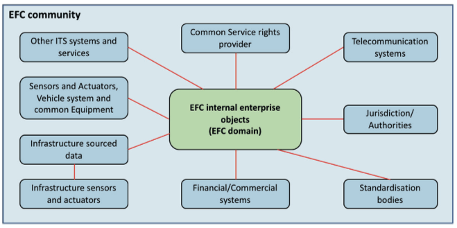
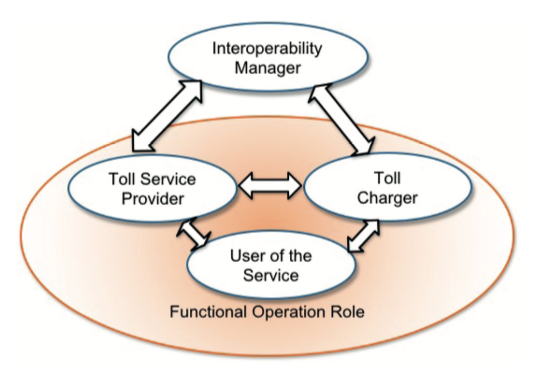
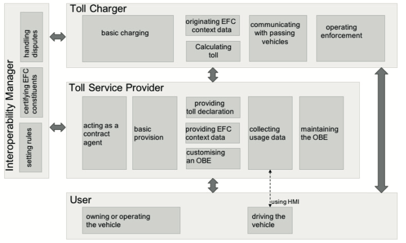
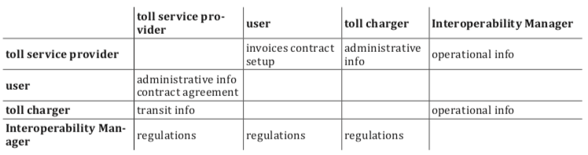

## Introduction

This standard, consisting of a single part (hereinafter referred to as the "described document"), defines the architecture for tolling environments. In these environments, a user who has a contract with only one Service Provider can use their vehicle across various Toll Domains operated by different Toll Chargers.

*Note: This Extract presents selected* *chapters* *of the described document and retains the original* *chapter* *numbering.*

## Usage

The objective of the document is to describe the architecture of tolling systems and the roles of individual stakeholders, including the definition of responsibilities and mutual interactions. However, the document does not define internal functions or responsibilities within individual roles.

Since the document relates to the overall functionality of tolling systems, including enforcement mechanisms, it is primarily relevant to public institutions with the authority to impose tolling obligations (and potentially subsequent collection) on defined sections of road infrastructure and the duty to manage said infrastructure.

## Scope

The document defines the architectural model, including roles, responsibilities, and mutual interactions. It also covers services provided within the tolling environment, terms and definitions used in EFC systems, and the identification of interoperable interfaces for communication between individual EFC systems.

## Related Documents (Selection)

The following standard is key to this document:

ISO 17427-1: Intelligent Transport Systems – Cooperative ITS – Part 1: Roles and responsibilities in the context of architecture for cooperative ITS.

## 3 Terms and Definitions

This clause contains 20 terms, the most important of which are the following:

**Interoperability** – The ability of systems to exchange information and utilize that information.

**tariff** **scheme** – A set of rules required to correctly determine the toll amount for a vehicle using road infrastructure within a toll domain

**toll** **domain** – An area or part of the road infrastructure subject to a toll regime

**toll** **regime** – A set of rules, including enforcement mechanisms, governing toll collection within a specific toll domain

**toll** **scheme** – The organizational perspective of a toll regime, including roles and their relationships

## 4 Abbreviations

This clause contains 17 abbreviations, the most important of which are the following:

**DSRC** Dedicated Short-Range Communication

**EETS** European Electronic Toll Service

**GNSS** Global Navigation Satellite System

**OBU** On-Board Unit

**RSE** Road-Side Equipment

**TC** Toll Charger

Other terms and abbreviations from the ITS domain can be found in the *ITS Terminology* dictionary (), the *StandardLand* website () or the *OBP platform* ().

## 5 EFC Organization: Roles and Objectives

This clause, spanning two pages, defines the individual roles within the EFC system architecture using internal and external organizational objects, as defined in ISO 17427-1. The categorization into external and internal roles (relative to the EFC system itself) reflects the necessity of a given role's existence within the implementation of the EFC system as such.

The distribution of these roles is illustrated in Figure 1 (blue denotes external roles, green denotes internal). This clause contains a detailed description and the purpose of individual external roles within the EFC community, for example:

- Telecommunications systems, providing communication services for data transmission between internal enterprise objects of the EFC system (fixed network) or data transmission services between the on-board unit and tolling equipment (wireless network).

- Standardization and certification authorities, defining EFC standards or standards related to EFC systems or relevant to individual toll domains.

**Figure 1 – Organizational** **objects in EFC (Fig.** **1 of the** **source standard)**

## 6 Internal Roles within the EFC Environment

This clause, spanning five pages, describes various internal roles within the EFC system environment as sets of responsibilities defined within the scope of EFC system functionality. Roles are described generically using associated responsibility groups, where each group encompasses items that are logically interconnected, either by their objectives and/or the actors assuming the respective role (see Figure 2 below):

- Interoperability Manager: Tasked with managing the rules of the overall toll regime. Responsibilities include:

- Defining security and data privacy concepts.

- Defining identification schemes and granting ID codes to tolling applications.

- Certification processes for equipment and operational permits, as well as dispute resolution and monitoring.

**Figure 2 – Roles in toll environment (Fig.** **2 of the** **source standard)**

Additionally, this clause provides a summary of the individual roles in terms of their responsibilities and mutual interactions (see Figure 3).

**Figure 3 – Roles and their interactions and responsibilities (Fig.** **3 of the** **source standard)**

## 7 Services

This clause, spanning 18 pages, provides a description of the services within the individual roles described in Clause 6, with respect to their interaction (i.e., the description of internal services within individual roles is outside the scope of the described document). Services are defined with respect to the roles involved, for example:

- Services involving the Toll Charger (TC), Interoperability Manager, and Service Provider include registration processes for the Toll Charger and Service Provider, dispute resolution, the exchange of trusted objects required for mutual communication, and the modification of toll regime rules (see Figure 4).

- Services involving the Service Provider and User include processes for the provision of contracts, customer services, and billing services.

- Services involving the Toll Charger and Service Provider include data collection regarding the usage of road infrastructure subject to tolling, exception handling, and payment services.

**Figure 4 – Services including toll charger, interoperability manager and service provider** **
(Fig.** **5 of the** **source standard)**

## 8 Physical Architecture of EFC

This clause, spanning 3 pages, briefly describes the physical architecture of the EFC system and its relationship to the architecture from ISO 17427-1.

## Annex A (informative) – Mapping of EFC architecture to C-ITS

Annex A spanning 3 pages, describes the principle of mapping the EFC architecture to the C-ITS organizational architecture model (ISO 17427-1), whereby the content of this standard relates only to roles responsible for system operation and functional operation.

## Annex B (informative) – Information schemes and basic information types

Annex B, spanning 6 pages, provides a viewpoint on the EFC architecture within the ODP (Open Distributed Processing) standard, which defines a total of 5 perspectives/viewpoints. Within this viewpoint, individual information classes (including information objects) are defined, which are communicated between the individual roles of the architecture (see Table 1).

**Table 1 – Information classes (Tab.** **8 of the** **source standard)**

## Annex C (informative) – Organizational Objects within Roles

Annex C, spanning five pages, contains a description of the individual roles of the EFC system architecture within organizational structures from the perspective of the following levels:

- Organizational level, describing the assigned responsibilities.

- Equipment level, identifying the individual objects used by actors to fulfill their roles (e.g., OBE – On-Board Equipment).

- Transport services level, describing the types of services provided within the toll domain.
