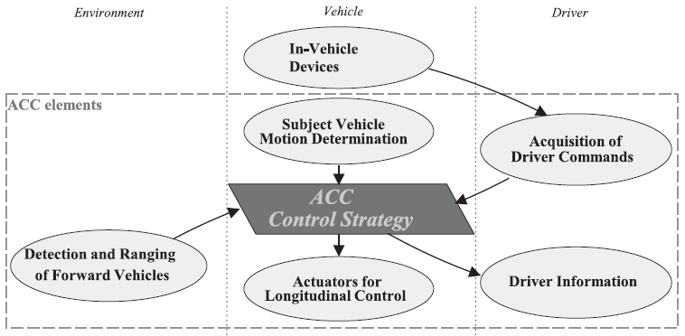
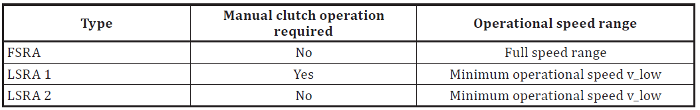
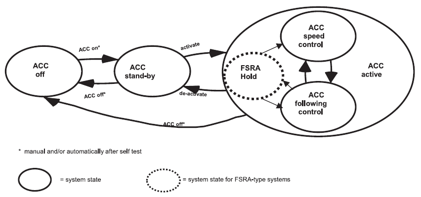
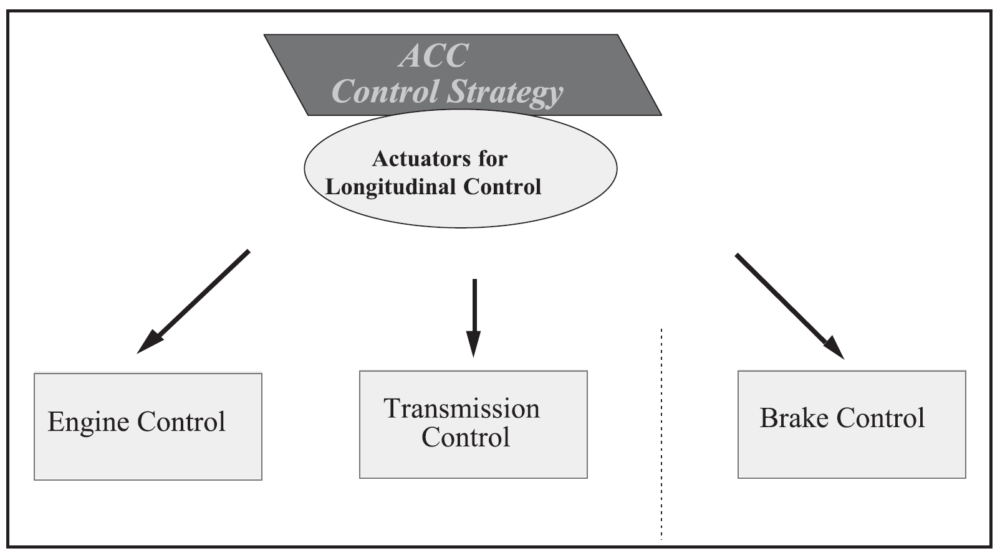

## Introduction

This standard belongs to the family of standards dealing with driver assistance systems and intelligent transport systems. The main function of Adaptive Cruise Control (ACC) is to control vehicle speed adaptively relative to a forward vehicle by using information concerning: (1) the distance to forward vehicles, (2) the motion of the subject vehicle equipped with ACC, and (3) driver commands. Based on the acquired information, the controller (ACC control strategy) transmits commands to the actuators responsible for longitudinal vehicle control and simultaneously provides status information to the driver (see Figure 1).

**Figure 1 — Functional ACC elements** **(Fig. 1 of the source standard)**

The objective of ACC is the partial automation of longitudinal vehicle control and the reduction of driver workload to support and relieve the driver in a convenient manner. ACC systems are designed to provide longitudinal control of equipped vehicles travelling primarily on highways under free-flowing traffic conditions and, in the case of Full Speed Range Adaptive Cruise Control (FSRA), also under congested traffic conditions.

For manufacturers of road vehicles, suppliers of telematics and driver assistance systems, testing laboratories and homologation authorities, this standard provides important guidance regarding functional requirements and performance test procedures applicable to ACC systems.

*Note**:* *This* ***Extract* ***presents* ***selected* ***chapters* ***of* ***the* ***described* ***document* *and* *retains* ***the* ***original* ***chapter* ***numbering**.*

## Usage

The standard can be used by vehicle manufacturers, suppliers of original equipment, testing laboratories, certification and homologation bodies, and developers of intelligent transport systems. The document can also serve as a system-level standard for more detailed standards addressing specific sensor technologies, ranging systems or higher levels of functionality.

## Scope

This document described specifies performance requirements and test procedures for Adaptive Cruise Control (ACC) systems. It describes the basic control strategy, minimum functionality requirements, basic driver interface elements, minimum diagnostic requirements and system reactions to failures.

ACC systems are implemented either as Full Speed Range Adaptive Cruise Control (FSRA) systems or Limited Speed Range Adaptive Cruise Control (LSRA) systems. LSRA systems are further divided according to whether manual clutch operation is required.

ACC is primarily intended to provide longitudinal vehicle control for vehicles travelling on highways under free-flowing traffic conditions and, for FSRA-type systems, also in congested traffic situations.

## Related Documents (selection)

The following referenced documents are indispensable for the application of this document:

ISO 2575 — *Road vehicles — Symbols for controls, indicators and tell-tales*

UN/ECE Regulation No. 13-H — *Uniform provisions concerning the approval of passenger cars with* *
**regard to* *braking*

## 3 Terms and definitions

The document contains 24 of terms and definitions related to ACC systems. The most important terms include:

**active** **brake control** — function that causes application of the brake(s), not applied by the driver, in this case controlled by the ACC system.

**Adaptive Cruise Control (ACC)** — enhancement to conventional cruise control systems that allows the subject vehicle to follow a forward vehicle at an appropriate distance by controlling the engine and/or power train and potentially the brake.

**brake** – part in which the forces opposing the movement of the vehicle develop.

**clearance** – distance from the forward vehicle’s trailing surface to the subject vehicle’s leading surface.

**time** **gap (τ)** – time gap calculated as clearance divided by vehicle speed.

**subject** **vehicle** – vehicle equipped with the ACC system in question.

**target** **vehicle** – vehicle followed by the subject vehicle.

**Full Speed Range Adaptive Cruise Control (FSRA)** – class of ACC systems allowing the subject vehicle to follow a forward vehicle by controlling the engine, power train and brake down to standstill.

**Limited Speed Range Adaptive Cruise Control (LSRA)** – class of ACC systems allowing adaptive following only above a defined minimum operational speed.

Additional ITS-related terminology may be found in dedicated ITS terminology databases.

## 4 Symbols and abbreviated terms

The standard defines 26 symbols and abbreviated terms related to longitudinal control, time-gap calculation, detection range, acceleration and deceleration parameters, curve radius, operational speeds and sensor characteristics.

Other terms and abbreviations from the ITS domain can be found in the *ITS Terminology* dictionary (), the *StandardLand* website () or the *OBP* *platform* ().

## 5 Classification

Different actuator configurations for longitudinal vehicle control lead to significantly different system behaviour. The standard therefore distinguishes between FSRA and LSRA systems (see Table 1).

**Table 1 — Classification of ACC system types** **(Tab. 1 of the source standard)**

The deceleration capability of the ACC system shall be clearly stated in the vehicle owner’s manual.

## 6 Requirements

This chapter describes the functional design of the system and its behaviour and intended operation.

### 6.1 Basic control strategy

ACC systems shall provide the following minimum control behaviour and state transitions:

when ACC is active, vehicle speed shall be controlled automatically either to maintain clearance to a forward vehicle or to maintain the set speed, whichever is lower;

transition between speed-control and following-control modes shall be performed automatically by the ACC system;

the steady-state clearance may be adjustable either by the system or by the driver;

if more than one forward vehicle is present, the target vehicle shall be selected automatically;

for FSRA systems, transition from following control to hold state shall occur after vehicle standstill;

for LSRA systems, activation of ACC shall be inhibited below the minimum operational speed.

The standard also defines ACC system states and transitions between “ACC off”, “ACC stand-by”, “ACC speed control”, “ACC following control” and “FSRA hold” states (see Figure 2).

**Figure 2 — ACC states and transitions** **(Fig. 2 of the source standard)**

### 6.2 Functionality

The requirements related to automatic transitions between ACC control modes and the behaviour of the system with respect to stationary or slow-moving targets, including stopping capability for FSRA and optionally LSRA systems, are specified in Clauses **6.2.1 Control modes** and **6.2.2 Stationary or** **slow-moving** **targets**. Clause **6.2.3** describes **Following** **capability**, including **Detection range on straight roads** (6.2.3.2), **Target discrimination** (6.2.3.3) and **Curve capability** (6.2.3.4).

### 6.3 Basic driver interface and intervention capabilities

#### 6.3.1 Operation elements and system reactions

The standard specifies the following operational requirements (in **11** **subclauses):**

the ACC system shall provide means for the driver to select a desired set speed;

driver braking input shall deactivate ACC functionality if the driver braking demand exceeds the ACC braking demand;

accelerator override by the driver shall always have priority over ACC engine power control;

ACC systems may automatically adjust the selected time gap according to environmental conditions such as poor weather;

if both conventional cruise control and ACC are available, automatic switching between these systems shall not occur.

#### 6.3.2 Display elements

The driver shall be provided with information regarding ACC activation state; selected set speed; forward vehicle detection status; failures or automatic deactivation of the ACC system.

Chapter **6.3.3 Symbols** notes that standardized symbols according to ISO 2575 shall be applied.

### 6.4 Operational limits

The standard defines operational limits for:

minimum operational speed;

maximum automatic acceleration;

maximum automatic deceleration;

maximum negative jerk;

behaviour at very short distances to the target vehicle.

### 6.5 Activation of brake lights

defines conditions under which the brake lights should be active.

### 6.6 Failure reactions

The clause defines the required system behaviour in the event of failures affecting individual ACC subsystems. Figure 4 illustrates the relationship between the ACC control strategy and the actuators responsible for longitudinal control, namely engine, transmission and brake control. Table 2 summarizes the corresponding failure reactions for failures in the engine, brake system, detecting and ranging sensor, and ACC controller, including conditions under which ACC control shall be relinquished or braking maintained temporarily. The driver shall be informed immediately about detected failures, and the warning shall remain active until the system is switched off. Reactivation of the ACC system is prohibited until a successful self-test has been completed after ignition cycling or ACC off/on switching.

**Figure** **3** **— Actuators for longitudinal control** **(Fig. 4 of the source standard)**

In case of failures, the driver shall be informed immediately, and ACC reactivation shall be prohibited until a successful self-test has been completed.

## 7 Performance evaluation test methods

This chapter specifies the environmental conditions, test targets and performance evaluation procedures used to verify the operational behaviour, detection capability and longitudinal control functionality of ACC systems.

### 7.1 Environmental conditions

Testing shall be performed on a flat and dry asphalt or concrete surface under specified environmental conditions, including temperature range and visibility requirements.

### 7.2 Test target specification

The standard defines test targets for:

infrared LIDAR systems;

millimetre-wave RADAR systems.

Radar test targets are specified using Radar Cross Section (RCS) values.

### 7.3 Automatic “Stop” capability test for FSRA-type only

The test verifies the capability of the FSRA system to stop the subject vehicle behind a target vehicle braking with a defined deceleration profile.

### 7.4 Target acquisition range test

This test verifies detection capability within the defined longitudinal detection zone. The standard specifies detection areas; reference planes; target presentation conditions; maximum acquisition time.

### 7.5 Target discrimination test

The test verifies correct target selection behaviour when multiple forward vehicles are present. Two vehicles travelling side-by-side are used to verify that the ACC system correctly identifies and follows the intended target vehicle. The clause is further divided into 7.5.1 General, 7.5.2 Initial conditions and 7.5.3 Test procedure, which specify the test scenario configuration, vehicle positioning and execution conditions for target discrimination evaluation.

### 7.6 Curve capability test

The curve capability test evaluates the ability of the ACC system to maintain vehicle following during steady-state driving on curves with specified radii and operating speeds.

## Annex A (normative) — Technical information

The annex provides supplementary technical parameters and reference characteristics used for ACC performance evaluation and sensor verification. Annex A.1 specifies the properties of infrared LIDAR test targets and includes the subclauses A.1.1 General, A.1.2 Reflector geometry, A.1.3 Reflectivity characteristics, and A.1.4 Coefficient for Test Target (CTT). Annex A.2 describes technical information related to RADAR Cross Section (RCS) characteristics for millimetre-wave RADAR systems and explains representative target properties for vehicle detection. Annex A.3 contains additional explanatory information related to target representativeness and system following capability evaluation.

## Bibliography

The bibliography includes 3 references related to driver behaviour in curves, sensor technologies, ACC system evaluation and longitudinal vehicle control.
