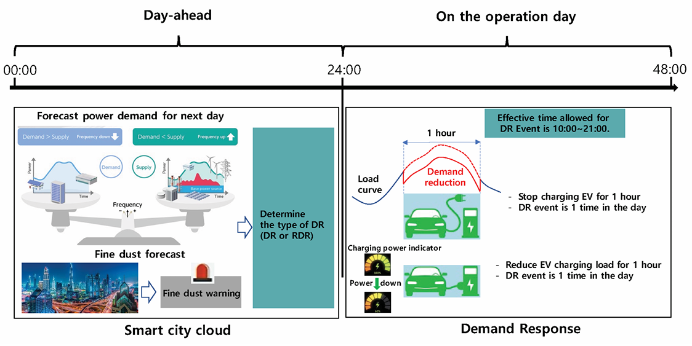
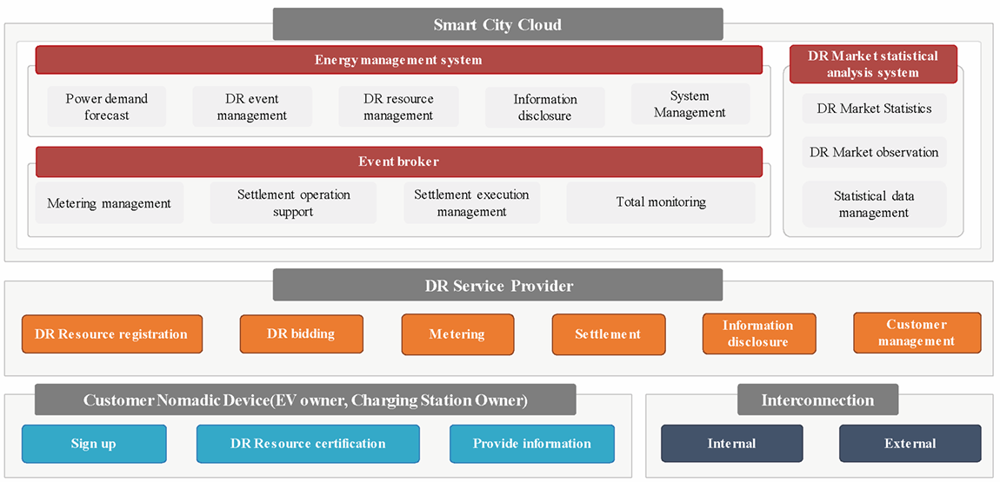

## Introduction

This standard defines data exchange requirements to support Electric Vehicle (EV)-based Demand Response (DR) services utilizing nomadic devices, considering two types of EV-based DR services. One is to reduce demand of electric vehicles charging when there is a shortage on the grid side. The other is to increase demand of electric vehicles charging when the surplus on the grid side is forecasted day ahead.

*Note: The extract lists selected chapters of the described document and adopts the original chapter numbering.*

## Use

The described document serves primarily for energy demand managers, i.e. energy distributors, decentralized energy system managers, electric vehicle fleet managers and governance bodies who want to manage local electricity offer and demand events by managing the operation and charging of electric vehicles.

## Scope

This standard specifies the data exchange requirements between related systems within smart city for EV based DR services utilizing nomadic devices as follows:

- EV-based DR service for demand reduction, called “demand response” during the shortage of reserve on electric grid or in response to fine dust warning issued according to air quality forecast

- EV-based DR for demand increase, called “reverse demand response”, instead of curtailment during excess electricity generation by renewable energy sources such as the sun and wind

This standard defines the requirements of main actors such as EV, nomadic device, smart city cloud, charging station and service provider to support EV-based DR services. This standard also defines data set and data processing procedure requirements for EV-based DR services.

## Related Documents (Selection)

The document described refers to ISO Guide 84 on climate change, standards related to charging of vehicles and energy markets (IEC 61851-1, IEC 62325, IEC 62746, IEC 62746-10-1), Application integration at electric utilities and electricity metering (IEC 61968, IEC 61968-9, IEC 61968-100, IEC 62055-31, Home Electronic System (HES) application model (ISO/IEC 15067-3-3), Vehicle to grid communication interface (ISO 15118-2, ISO 15118-20, DIN SPEC 70121:2014-12 and Open Charge Alliance protocols.

## 3 Terms and definitions

This part of the technical standard defines 13 terms and 23 abbreviations, the key of which are the following:

**customer baseline load (CBL)** the pattern of electric demand as usual, is needed to measure performance of DR program

**DR meter** the meter installed by the service provider to measure load amount of the customer.

**electric vehicle supply equipment (EVSE)** equipment or a combination of equipment, providing dedicated functions to supply electric energy from a fixed electrical installation or supply network to an EV for the purpose of power transfer.

**EV based DR** **service** DR activity by which the cost of charging electric vehicles is modified to cause consumers to shift consumption patterns

**reverse DR resource** DR resources for the purpose of large-scale transaction of power load increase, and electricity users of all types of contracts as participating customers without restrictions on the types of electricity use contracts concluded by electricity users in the Jeju area with sales companies or district electric operators

**standard DR resource** DR resource that refers to national DR and includes electricity users with a contracted power of 200 kW or less, residential electricity users, and individual households belonging to collective buildings among electricity use contracts concluded with sales companies or district electric business operators as customers participating in DR

**virtual end node (VEN)** client and can be an EMS, a thermostat or other end device that accepts the OpenADR signal from a server (VTN)

**virtual top node (VTN)** server that transmits OpenADR signals to end devices or other intermediate servers

**CSMS** charging station management system

**CSO** charging station operator

**DR** demand response

**EMS** energy management system

**EV** electric vehicle

Other terms and abbreviations from the ITS domain can be found in the *ITS Terminology* dictionary ([www.itsterminology.org](http://www.itsterminology.org)), the *StandardLand* website ([www.standardland.cz](http://www.standardland.cz)) or the *OBP platform* ([www.iso.org/obp](http://www.iso.org/obp)).

## 4 Supported EV-based DR services

Chapter 4 is 8 pages long and describes supported EV based DR services by 5 figures and 3 tables. A common DR service is described in 4.1, illustrated at the figure 1, the reverse DR service is described in 4.2. The procedures for EV based DR services are described in 4.3 using a figure and a table to describe the steps of the processes for the following services:

- **a standard DR service procedure** (from Contract & Registration via DR implementation & metering to Calculation & Settlement)

- **a Fine dust DR service procedure** (from Contract & Registration via DR Bidding to DR implementation & metering and Calculation & Settlement)

- **a Reverse DR service procedure** (from Contract & Registration via DR Bidding to DR implementation & metering and Calculation & Settlement)

**Figure 1 (Figure 1 of the source document) – EV-based standard DR service**

## 5 Requirements for main actors

Chapter 5 is 5 pages long and describes the requirements for the main actors, as illustrated at the figure 2. These are requirements for EV requirements (5.2), EVSE requirements (5.3), Nomadic device requirements (5.4), Service provider requirements (5.5), Smart city cloud requirements (5.6) and Metering device requirements (5.7)

**Figure 2 (Figure 6 of the source document) ­– Requirement of each actor for EV-based DR service**

## 6 Requirements for communication

Chapter 6 is 2,5 pages long and describes the requirements for wired as well as wireless communication, including the figure illustrating the communication architecture. It references IEC 62746-10-1 that provides a standardized and secure DR interface that allows electricity providers to communicate DR signals directly to existing customers using a common language and existing communications such as the Internet.

## 7 Data set and data processing for EV-based DR

Chapter 7 is one-page description of data sets exchanged between actors in each EV-based DR service in a single table.

## Annex A (informative)

is 4 page long and presents 4 different use cases. Each use case is described within a table, containing service type, customer, charging control, location of charging station and data exchange actors, and complemented with a figure of the communication architecture.

## Annex B (informative)

is 3 page long and presents 3 forms to be filled in: DR customer application for registration, Consent to collection and use of personal information and Consent to collection and use of information

## The bibliography

provides 1 reference to the use cases and architecture of distributed energy storage systems (IEC CDV 63382).
