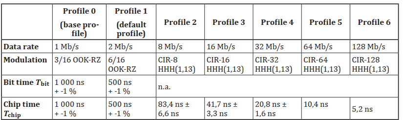
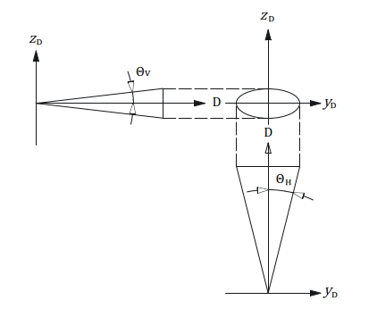
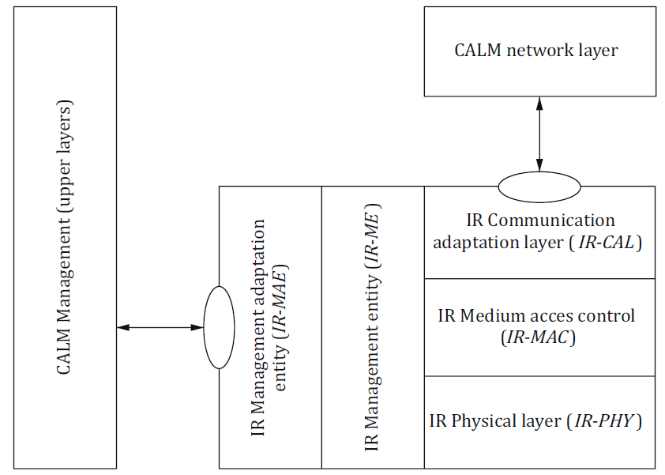

## Introduction

The ISO 21214 international standard (hereinafter referred to as the described document) introduces a set of functional requirements for the communication interface of an ITS station.

The concept of ITS communications (formerly CALM) is a set of requirements aimed at unifying communication systems within ITS. It introduces the concept of an ITS station, which represents the basic building block of this communication architecture. For more information, see the Extract from ISO 21217.

A key feature of the ITS station is its ability to use various communication protocols with different access technologies. The described document specifies the method of data exchange, via an infrared interface operating at wavelengths from 850 nm to 1010 nm, and expands the interface specification with compatibility with the ITS station according to ISO 21217. For the purposes of the standard, this interface is referred to as IR. This is the second edition of the standard.

*Note: This Extract presents selected chapters of the described document and retains the original chapter numbering.*

## Usage

The document establishes principles for implementing the IR interface into an ITS station within CALM.

For public administration authorities, it provides basic technical information to form an idea of the possibilities of using the IR interface in the ITS environment.

For manufacturers of telematics devices and their operators, it defines the requirements for communication between ITS stations in the ITS interface environment.

## Scope

The described document specifies requirements for the implementation of the IR communication interface into the access layer of the ITS-S station. The document further specifies requirements for the Communication Adaptation Layer (CAL) and the Management Adaptation Entity (MAE) layer of the ITS station.

## Related Documents (Selection)

The related standards are primarily those of the ITS communication group (CALM). The clause does not specify these standards in detail.

In addition to the ITS communication (CALM) standards, it references the following two standards:

*ISO/IEC 8802-11:1999, Information technology — Telecommunications and information exchange between systems — Local and metropolitan area networks — Specific requirements — Part 11: Wireless LAN Medium Access Control (MAC) and Physical Layer (PHY) specifications*

*IEC 60825-1, Safety of laser products – Part 1: Equipment classification, requirements and user’s guide*

## 2 Conformance

This clause contains a short paragraph with a single-line declaration stating that the standard conforms to the requirements of related international standards.

## 4 Terms and Definitions

The standard introduces 36 new terms. Other terms and abbreviations are provided in ISO 21217 and other CALM standards. In a separate paragraph, the standard introduces terms for the optical characteristics of the interface. Examples of terms and definitions:

**communication zone** – spatial zone in which two CALM-IR units are able to communicate with acceptable performance

**registration phase** – phase where a master identifies devices newly entering his communication zone

**wake-up window; WuW** – special case of a broadcast window and is used to “wake-up” sleeping units entering the communication zone of an active master

## 5 Symbols and abbreviated terms

The standard contains 82 abbreviations. Example abbreviations:

**CIR** circular QAM *(a type of quadrature amplitude modulationcircular QAM)*

**HHH** Hirt, Hassner, Heise (inventors of the HHH(1,13) code) *(packet coding and modulation developed specifically for IR communication)*

**IR ** infrared *(infrared-based communication interface)*

**McW** multicast window

**TDMA** time division multiple access

***θH*** horizontal opening angle

***θV*** vertical opening angle

*NOTE: Other terms and abbreviations from the ITS domain can be found in the ITSTerminology dictionary (*[www.itsterminology.org](http://www.itsterminology.org/)*), the StandardLand website (*[www.standardland.cz](http://www.standardland.cz/)*) or the OBP platform (*[www.iso.org/obp](http://www.iso.org/obp)*).*

## 6 Requirements: Transmitter and Receiver Parameters

This clause, spanning 3 pages, defines the requirements for the IR receiver and IR transmitter in the form of parameter tables.

Article **6.1 Transmitter wavelengths and bandwidth and** Article **6.2 – Radiated power**, both on a single page, define the technical requirements for the transmitter (wavelength, bandwidth, radiated power). For example parameters, see Table 1. The clause also defines 11 transmitter classes (based on radiated power).

**Table 1– IR transmitter parameter specification (Tab. 1 of the source standard)**

<table>
  <tr>
    <th>Parameter</th>
    <th>Specification Channel 870 Channel 970 (main channel) (alternative channel)</th>
  </tr>
  <tr>
    <td>TX1 Nominal transmitter wavelength</td>
    <td>870 nm 970 nm</td>
  </tr>
  <tr>
    <td>TX2 Transmitter pass band</td>
    <td>820 nm to 910 nm 920 nm to 1 010 nm</td>
  </tr>
  <tr>
    <td>TX3 Coherence length</td>
    <td>&lt; 1 mm</td>
  </tr>
  <tr>
    <td>TX4 Total radiated power</td>
    <td>Dependent on transmitter class (see 6.2)</td>
  </tr>
  <tr>
    <td>TX5 Minimum receiver in-band (RX2) radiated power</td>
    <td>80 % of TX4</td>
  </tr>
  <tr>
    <td>TX6a Radiated power below pass band</td>
    <td>not specified &lt; 10 % of TX4</td>
  </tr>
  <tr>
    <td>TX6b Radiated power above pass band</td>
    <td>&lt; 10 % of TX4 not specified</td>
  </tr>
</table>

Article **6.3 Receiver wavelengths and bandwidths** and Article **6.4 – Receiver class** span two pages and define, in the form of two tables, the technical requirements for the receiver (wavelength, bandwidth).

Clause 6 also defines 16 receiver classes (based on receiver sensitivity).

## 7 Modulation and Coding

This clause, spanning 3 pages, defines the basic set of requirements for modulation and coding in the IR environment. It provides the basic structure of a data packet at the OSI model physical layer, including pulse durations in μs. It also defines interface communication profiles (see Table 2 (Table 9 of the standard) – Communication profiles).

**Table 2 – Excerpt of Table 9 of the source standard: Communication profiles**

## 8 Directivity and Communication Zones

This clause, spanning 3 pages, defines the geometrical and spatial requirements for the interaction of IR-based communication interfaces. It first graphically displays the geometric space of IR communication, and then shows the geometric intersection of two IR communication interfaces (see Figure 1). The next part of the clause defines communication zone shortcuts, which are essentially various geometric configurations of IR communication in space, with specific parameter values assigned according to the spatial arrangement shown in Figure 1.

**Figure 1 – Horizontal opening and vertical opening angles in IR communication (Fig. 5 of the source standard)**

## 9 Frames and Windows

This clause, spanning 20 pages, describes the general structure of communication frames in IR communication. It also defines the communication diagram for simultaneous communication of multiple IR units. Data frames are separated by a special frame structure, also described in this clause. Frames are divided into communication windows, which are also defined in this clause (management window, private window, multicast window, broadcast window, compatibility window, spare window, wake-up window).

## 10 MAC Commands

This clause, spanning 35 pages, describes the commands at the data link layer of the OSI model, which are used to signal interface activity between MAC communication participants. The respective subclauses describe this signalling, based on the requirements of different control units of the ITS station (specifically the IR-CAL communication adaptation layer, the IR-MAE management adaptation entity, and the IR-ME management entity). The clause also details individual MAC commands, in text and in parameter tables.

## 11 Registration Procedure

This clause, spanning 4 pages, describes, in text, tables, and diagrams, the registration procedure used to register the IR interface into communication.

## 12 Window Management

This clause, spanning 2 pages, describes, in text, the mechanism for managing communication windows within IR communication. This especially includes allocating sufficient communication time for individual IR interfaces in communication, managing communication windows for time-critical applications, controlling the required IR interface response time, and more.

## 13 IR Management Entity

This clause, spanning 4 pages, describes, in text and tables, the basic features of the IR interface management entity (IR-ME), which is responsible for managing the IR MAC layer and the IR physical layer of the OSI model. This unit also ensures connectivity with the higher layers of the ITS station.

## 14 Adaptation

This clause, spanning 6 pages, describes in text, diagrams, and tables, how to integrate the IR interface into the structure of the ITS station. The adaptation structure of the IR interface into the ITS station is shown in Figure 2.

**Figure 2 – Medium adaptation of the IR interface into the ITS station (Fig. 17 of the source standard)**

## 15 Adoption of Other Standards and Internationally Accepted Practices

This one-paragraph clause, with a reference to ISO 21217, describes how to apply the described document using local (regional) conditions and standards.

## 16 Marking and Labelling

This one-paragraph clause defines the requirements for labelling devices that contain IR interfaces compatible with the described document.

## 17 Declaration of Patents and Intellectual Property

This clause, spanning 3 pages, refers to patent ownership associated with the implementation of IR interfaces compatible with the described document.

## Annex A (Normative) - Coding and Error Correction of Profiles 0 and 1 and of Commands

This 2-page annex contains textual and tabular definitions of error correction algorithms for the given communication profiles.

## Annex B (Normative) - Coding and Modulation of Profile 2 to Profile 6

This 7-page annex contains textual and tabular definitions of error correction algorithms for the given communication profiles.

## Annex C (Informative) - Link Power Budget

This 6-page annex contains texts, diagrams, and tables, describing the implementation of the IR interface where the power consumption in the “in-vehicle unit and roadside equipment” system is shifted to the roadside equipment. This model simplifies the implementation of the IR interface in vehicles.

## Annex D (Informative) - Link Directivity Considerations

This 2-page annex provides texts and diagrams, with examples of antenna placement for the IR interface on vehicles.

## Annex E (Informative) - Compatibility of CALM and Non-CALM Infrared Systems

This 2-page annex describes in text the basic mechanisms to ensure compatibility of the IR interface according to the described document with IR devices that do not meet the ISO 21214 requirements.

## Annex F (Normative) - Specification of MR-IR Communication Protocol for Compatibility with ISO 21214

This 25-page annex describes in text, tables, and diagrams, the requirements for adapting the data layer of the existing MR-IR interface to achieve compatibility with the requirements of the described document.

## Annex G (Informative) - Summary of changes between this version of ISO 21214 and the previously published version

This 2-page annex contains a list of changes, compared to the original edition of the standard.
