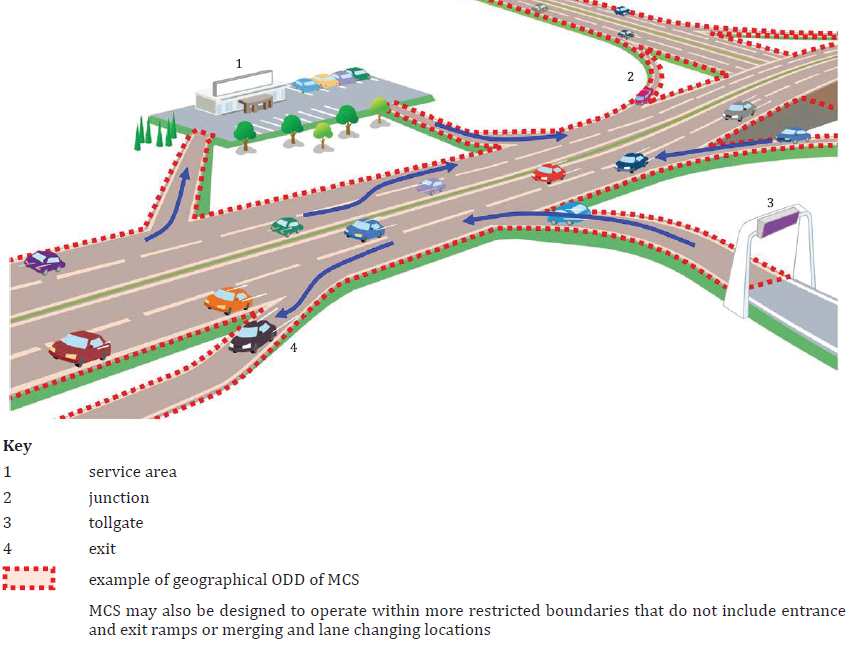

## Introduction

This document specifies a framework and general requirements for Level 3 automated driving systems intended for motorway operation. The standard defines the concept of a Motorway Chauffeur System (MCS) as a specific implementation of an automated driving system (ADS) that performs the entire dynamic driving task (DDT) within the current lane of travel in the presence of a fallback-ready user (FRU). The document establishes a systematic framework including system characteristics, operational design domain (ODD), state models and state transitions, functional requirements, minimum DDT performance requirements, and test scenarios.

*Note: This Extract presents selected chapters of the described document and retains the original* *chapter* *numbering.*

## Use

This document is primarily intended for vehicle manufacturers, developers of automated driving systems, automotive industry developers, testing organizations, and regulatory authorities. It provides a reference framework for the design, specification, verification, and assessment of MCS systems and may serve as a basis for further standardization activities or regulatory requirements related to motorway automated driving.

The specification can also be used for the development of internal manufacturer requirements and for creating test scenarios and validation procedures.

## Scope

This document specifies the framework, characteristics, functionalities, and minimum performance requirements for a motorway chauffeur system (MCS) performing Level 3 automated driving on motorways.

The standard specifies the basic functionalities required for in-lane operation, defines requirements related to the generation of request to intervene (RTI), specifies requirements for continuation of operation after issuing an RTI, defines minimum DDT performance requirements, and specifies test procedures. Advanced functionalities such as lane changing are addressed in other parts of the series.

This document is limited to MCS operation on limited access motorways and does not cover other forms of system engagement or means related to setting a destination and selecting a route.

## Related Documents (Selection)

The standard normatively references ISO 15622:2018 related to performance requirements and test procedures for adaptive cruise control systems and ISO/SAE PAS 22736 defining terminology for driving automation systems for on-road motor vehicles.

Most additional related standards, technical specifications, and research documents are listed in the bibliography of the standard, which provides a broader context for safety, validation, and system-level frameworks of automated driving systems.

## 3 Terms and definitions

The document explicitly defines 6 terms and definitions (selection):

**motorway** **–** road specially designed and built for motorized traffic that does not serve properties bordering on it

**route** **–** planned sequence of waypoints to reach a destination

**trajectory** **–** sequence of locations that define the intended motion vector of the subject vehicle

**vehicle motion control (VMC)** **–** activities necessary to adjust vehicle movement continuously in real time, which include “lateral vehicle motion control” and “longitudinal vehicle motion control”

## 4 Symbols and abbreviated terms

The document defines 14 abbreviated terms (selection):

MCS Motorway chauffeur system

FRU fallback-ready user

DDT dynamic driving task

RTI request to intervene

MRM minimal risk manoeuvre

MRC minimal risk condition

OEDR object and event detection and response

TTC time to collision

Other terms and abbreviations from the ITS domain can be found in the ITSTerminology dictionary (), the StandardLand website () or the OBP plataform ().

## 5 Characteristics of MCS

Clause 5 defines the conceptual framework of the system and its operational scope. It forms the basis for detailed operational requirements in Clause 6 and minimum functional requirements in Clause 7.

### 5.1 General

This subclause defines the fundamental nature of MCS as a Level 3 implementation requiring the presence of a fallback-ready user. MCS can be implemented in various forms; however, all implementations shall comply with the prescribed operational design domain.

### 5.2 Operational design domain

This subclause is further divided into five parts and systematically describes the ODD. Subclause **5.2.1 General** specifies the requirement to define a pre-defined ODD for the system (Figure 2). Subclause **5.2.2 Roadway physical characteristics** describes the physical structure of the motorway, lane configurations, profiles, curvatures, and related characteristics. Subclause **5.2.3 Traffic in the surrounding environment** addresses characteristics of surrounding traffic and other vehicles.

Subclause 5**.2.4 Abnormalities in roadway operational condition** includes extraordinary situations such as road works or incidents. Subclause **5.2.5** **Ambient** **environmental conditions** describes weather and lighting conditions.

**Figure** **1** **— Example of geographic boundary (geofence) of an ODD** **(Fig. 2 in the source document)**

### 5.3 System functionalities

This subclause is divided into 5.3.1 General, 5.3.2 Basic functionalities to realize in-lane operation, and 5.3.3 Lane changing functionalities. Subclause 5.3.2 establishes linkage to Clause 6 and specifies implementation of the basic functionalities including performing the DDT, issuing RTIs, and capability to safely stop the vehicle. Subclause 5.3.3 distinguishes discretionary and mandatory lane changes and references other parts of the series.

### 5.4 System limitations

Situations that may lead to performance-impairing or incapacitating effects, and their possible consequences, should be documented (referenced to the further chapters 6.4.2.5-6).

### 5.5 Providing information to the user

The standard requires that, prior to first use, the user shall be informed about system functionalities, limitations, engagement conditions, and situations that may lead to a request to intervene. This clause establishes an important connection between technical requirements and human factors (referenced back to 5.2-5.4).

## 6 Operational requirements

Clause 6 represents the core of the standard and is systematically divided into Clauses 6.1 to 6.4, while Clauses 6.2 and 6.3 contain additional extensive subdivision.

### 6.1 Operating conditions

Subclause 6.1 is divided into 6.1.1 General, 6.1.2 Engagement conditions, 6.1.3 Disengagement triggering conditions, and 6.1.4 Direct disengagement conditions.

Subclause 6.1.2 specifies the conditions under which the system may transition into the normal state. Subclause 6.1.3 defines situations in which an RTI shall be generated, for example when leaving the ODD or when system performance deteriorates. Subclause 6.1.4 describes direct user interventions, such as steering override, leading to immediate disengagement.

### 6.2 State transition

Subclause 6.2 State transition includes subdivisions 6.2.1 to 6.2.5. Subclause 6.2.1 General introduces the state model. Subclauses 6.2.2 Off state, 6.2.3 Standby state, 6.2.4 Normal state, and 6.2.5 Requesting fallback state define individual system states and their meaning.

### 6.3 System functions

Subclause **6.3 is the most extensive part and contains 14 subclauses.**

Subclause 6.3.1 General includes an overview of system functions in tabular form.

Subclause 6.3.2 Object and event detection and response describes OEDR requirements. Subclause 6.3.3 Vehicle motion control defines requirements for longitudinal and lateral vehicle control. Subclause 6.3.4 Generation of request to intervene specifies requirements for multimodal signalling. Subclause 6.3.5 Status indication addresses continuous communication of system state to the user.

Further subclauses, namely 6.3.6 User control interface, 6.3.7 FRU input detection, 6.3.8 MCS monitoring the FRU, 6.3.9 Subject vehicle condition monitor, 6.3.10 MCS condition monitor, 6.3.11 Localization, 6.3.12 External warning generation, 6.3.13 Functions required for route following functionalities, and 6.3.14 Related functions further elaborate individual areas of the functional system architecture.

For example, detailed requirements related to route following functionalities are specified in 6.3.13.1 and 6.3.13.2, addressing path selection and related manoeuvres, while 6.3.14.1 and 6.3.14.2 address minimal risk manoeuvres and wireless communication.

### 6.4 Requirements for continuing operation after detecting disengagement-triggering conditions

Subclause 6.4 is divided into 6.4.1 General, 6.4.2 Classification of adverse situations, and 6.4.3 Responses to adverse situations.

Subclause 6.4.2 introduces five severity levels of situations, ranging from situations with potential future effect to situations with incapacitating effect. Subclause 6.4.3 specifies corresponding system responses, including continued operation, issuing an RTI, or transition to a minimal risk manoeuvre.

## 7 Minimum performance requirements of the DDT

Clause 7 represents the normative core defining functional performance parameters of the system. While Clause 6 defines operational logic and functional architecture, Clause 7 specifies concrete minimum behavioural requirements for performing the dynamic driving task (DDT) during normal and degraded operation.

**7.1** **General**

This subclause defines the scope of Clause 7 and emphasizes that the requirements apply to system behaviour within the prescribed operational design domain.

**7.2** **Operating speed range**

This subclause specifies that the minimum operating speed range of the system shall include 0 km/h, meaning capability for complete stopping and subsequent restarting.

**7.3** **Normal operation**

This subclause is further divided into 7.3.1 Sustained longitudinal vehicle motion control, 7.3.2 Sustained lateral vehicle motion control, and 7.3.3 Crash avoidance. This part contains the most specific technical limits.

Subclause 7.3.1 specifies that the system shall be capable of maintaining a safe distance from the forward vehicle and responding to its deceleration.

Subclause 7.3.2 specifies requirements for sustained lateral vehicle motion control, including maintaining the subject vehicle within the current lane of travel under defined roadway geometric conditions. It considers roadway profile and effects at higher speeds.

Subclause 7.3.3 specifies minimum requirements for system response in situations involving sudden changes in traffic conditions. The standard provides specific reference scenarios, such as aggressive cut-in from the adjacent lane with a time to collision (TTC) greater than 2,5 s, and response to an obstacle at least the size of a passenger vehicle’s free-standing tyre. This part establishes a direct link to the test scenarios in Clause 8.

**7.4** **Performance-impaired operation**

This subclause builds upon the classification of adverse situations defined in 6.4.2 and specifies minimum requirements and recommendations for performance-impaired operation.

**7.5** **MCS reaction to unresponsive FRU**

This subclause specifies the required system response when the fallback-ready user does not adequately respond to a request to intervene and no performance-impairing or incapacitating situation is present. This part creates a direct linkage to the functional requirements related to minimal risk manoeuvres specified in 6.3.14.1 and to the test scenarios defined in Clause 8.

## 8 Test procedures

Clause 8 specifies test procedures intended to verify compliance with the operational and performance requirements defined in Clauses 6 and 7. The clause is systematically divided into general testing requirements and individual scenario-based test procedures.

### 8.1 General

Subclause 8.1 is divided into 8.1.1 Purpose, 8.1.2 Driving environment, 8.1.3 System settings and test driver roles, 8.1.4 Common test pass criteria, 8.1.5 Confirmation of the HMI design, 8.1.6 Success rate and number of trials, 8.1.7 List of test scenarios, and 8.1.8 Test sites.

**Clause** **8** **describes the following scenarios:**

**8.2** **Scenario 1: MCS reaction to unresponsive FRU**

This scenario verifies system behaviour when the fallback-ready user does not respond to an RTI.

**8.3** **Scenario 2: Direct disengagement by steering input**

This scenario verifies direct disengagement initiated by user steering input.

**8.4** **Scenario 3: Continued operation after brake intervention**

This scenario evaluates the capability of the MCS to continue operation following a brake intervention by the user under specified conditions.

**8.5** **Scenario 4: Forward vehicle braking hard**

This scenario evaluates the response of the MCS to significant deceleration of the forward vehicle.

**8.6** **Scenario 5: Aggressive cut-in from the adjacent lane**

This scenario (performed under two different speed and distance conditions) evaluates system response to a vehicle aggressively entering the lane in front of the subject vehicle from an adjacent lane.

**8.7** **Scenario 6: Obstacle in lane**

This scenario evaluates system behaviour when an obstacle is present within the current lane of travel.

**8.8** **Scenario 8: Approaching geographical ODD boundary**

This scenario verifies system behaviour when the subject vehicle approaches the geographical boundary of the prescribed ODD.

**8.9** **Scenario 9: Engagement restricted outside ODD**

This scenario verifies that the MCS does not engage outside its prescribed operational design domain.

## Bibliography

The bibliography contains references to additional standards, technical specifications, and research documents related to automated driving systems, operational design domains, safety assessment, validation methodologies, human-machine interaction, and advanced driving functionalities.

Document does not provide any **Annexes**.
