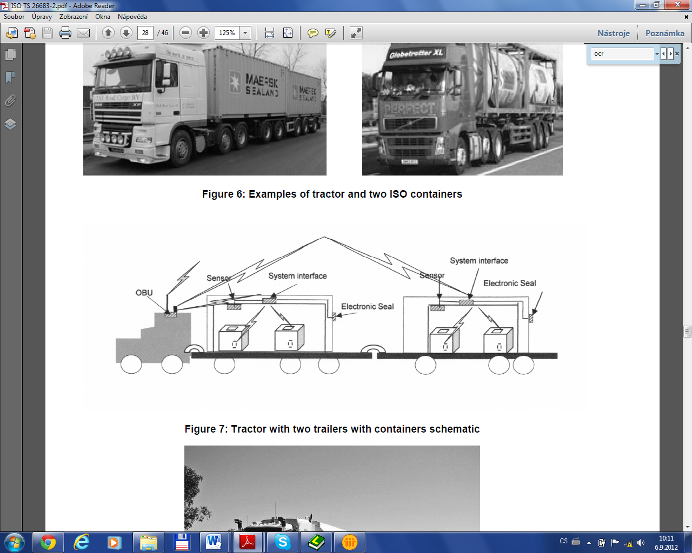

## Introduction

The ISO 26683 (FLC‑CIC) set of standards uses advanced information and communication technology for freight transport, focusing on the presentation of data when providing end‑to‑end services related to cargo and their means of transport. It does not provide a system design, nor does it specify the technologies to be used.

> The aim is to enable the effective handling of vehicle and trailer/semi‑trailer identification in connection with en‑route cargo information within the vehicle’s on‑board system. This supports real‑time vehicle tracking and tracing, as well as cargo monitoring. It enables shipment auditing and provides visibility into cargo status.

> provides the context and architecture for the collection and transmission of aggregated data on cargo and transport units to carriers’ commercial operating systems or to public‑sector systems (e.g. customs, transport statistics, international trade). It also lists the reference standards relevant to all parts of this standard family.

> (further on also referred to as “the document described”) contains descriptions of various application interface profiles for communication during the identification of cargo or the contents of freight vehicles, linked to other services such as handling in multimodal transport.

*Note: The Extract presents selected chapters of the described document and retains the original chapter numbering.*

## Usage

> This set of standards provides examples for designing interoperable systems related to transport means and cargo. It covers the provision of information for tracking, managing, and tracing goods in multimodal transport and handling — from the individual item level, regardless of the number or type of packaging or transport units, to the description of the connection with the transport vehicle/unit and the infrastructure (e.g., a dispatch centre).

> The document described specifies interface profiles for various types of communication that enable interoperability in multimodal freight transport. The document allows readers to understand scenarios for possible freight‑unit configurations and the related communication using the defined profiles. In addition to the technical description, each profile includes a set of standards that must be considered for interoperability, presented in a clear and detailed way for potential users.

## Scope

The document described focuses on application interface profiles for data aggregation and transfer in the context of ISO 26683-1. It enables the provision of interoperable data for the visibility of goods during transport and for services in land freight transport, through the specification of application interface profiles. The interfaces relate to various types of communication between the cargo item, semi-trailer or trailer, vehicle, and infrastructure. It also includes representations of the physical configurations of different combinations of semi-trailers or trailers with a road tractor.

## Related Documents (Selection)

Related standards (59) are listed in Clause 2, References to Standards, and in the Bibliography (9) at the end of the standard. The most relevant standards are the other parts of the FLC‑CIC set. For the primary list of referenced standards see ISO 26683-1.

used in particular profiles are listed in Clause 6, directly within the individual application interface profiles.

## 3 Terms and Definitions

This clause defines 33 terms; the Extract lists only selection of the most important ones:

**application interface –** communication point where one part of a system communicates with another in order to service an application **

**application interface profile** – series and sequence of behaviour and protocols including, where appropriate, the identification of chosen classes, conforming subsets, options and parameters of those base standards necessary to accomplish a defined function at an interface in a particular way such that it can be used interoperably between two parties

**interrogator** **–** a device performing reading functions, additionally capable of sending data to the on-board equipment (OBE) via wireless transmission

**reader** **–** a device that communicates with the OBE to read or write information

## 4 Abbreviations

The standard contains 35 abbreviations; relevant for understanding this Extract are:

**DSRC** **–** dedicated short range communication

**FLC-CIC** **–** freight land conveyance content identification and communication

**IMS** **–** IP multimedia subsystem (a standard for an architectural framework)

**OBE/ –** on-board equipment/on-board unit

**OCR –** optical character recognition (ie. a symbol for a product description)

**PDE –** portable data collection equipment

**PHS –** personal handy-phone system

**RFID –** radio-frequency identification

**UBL –** universal business language *(standard by , for business, including a library for transport)*

**UMTS** **–** universal mobile telecommunication system *(for 3G networks)*

**WPA –** WiFi protected access secured *(WiFi access, using encryption)*

NOTE: Other terms and abbreviations from the ITS domain can be found in the ITSTerminology dictionary (*)*, the StandardLand website () or the OBP platform (*).*

## 5 Context

Clause 5 is about half a page long. It refers back to the context information provided in ISO 26683-1. The document described focuses on interface profiles for data transmission. All profiles are optional/voluntary, and when applied in accordance with the document described, they provide a basis for interoperability.

A brief overview of data transmission is provided in the following subclauses: 5.2 Transfer of data from tags to interrogators (Profile Level 3); 5.3 Transfer of data from trailers to OBE (Profile Level 2); 5.4 Transfer of data from OBE to infrastructure (Profile Level 1).

## 6 Freight land conveyance content and communication – Application interface profiles

Clause 6, comprising 32 pages, forms the core of the document. It provides a detailed description of the communication levels and the corresponding individual application interface profiles associated with each level.

### 6.1 General

The document does not define a single specific application interface profile. Instead, it “provides interoperability where a communication medium has been selected and is in compliance with one or more of the standards referenced in Annex A of ISO 26683-1.” The profiles conform to the profile format defined in .

### 6.2 Taxonomy of freight land conveyance content and communication application interface profiles

Profiles for three basic levels of communication are specified. There is also a fourth layer for profiles, independent on scenarios, to be used accordingly to the needs of its instance and demand of the user.

Level 1 (L1): from the vehicle's OBE to the roadside infrastructure

Level 2 (L2): a) from the trailer(s) to the OBE or b) from items directly to the OBE

Level 3 (L3): from the item (incl. item sensors) to the interrogator/OBE of the trailer

Level D1: for data presentation only; data formatting in UBL, accordingly to potential requirements

The **following clauses** deal with application profiles, related standards, requirements, and compliance. The method of data collection and auditing for identifying the cargo list is not defined in the profiles and is of an individual decision of the participant. The clauses below describe the 11 profiles for all of the above mentioned levels, L1 through L3 and D1.

### 6.3 FLC-CIC Profile No.L1-1: ISO 15628 DSRC (optional)

The scenario for the profile is as follows: data from the cargo is collected using DSRC on-board communication; the device uses the DSRC application layer in accordance with .

### 6.4 FLC-CIC Profile No.L1-2: ISO 21215 CALM M5Hz DSRC (optional)

The scenario focuses on collecting data from cargo via on-board DSRC equipment, and using 5 GHz communications stations (CALM) in accordance with .

### 6.5 FLC-CIC Profile No.L1-3: ISO 10374 (optional)

This scenario describes the possibility of collecting cargo data via on-board equipment, communicating in accordance with (for automatic container identification). Communication can run in any point of the route where are:

interrogators in accordance with

an on-board transponder in accordance with

### 6.6 FLC-CIC Profile No.L1-4: GSM/UMTS/LTE/IMS/PDC/PHS (optional)

This profile uses the wireless communication among devices designed by for 3G mobile systems in GSM networks and for radio technologies.

### 6.7 FLC-CIC Profile No.L1-5: ISO IEC 18000 (optional)

Scenario of the profile enables the collection, archiving, and transmission of data from cargo via on-board equipment, communicating in accordance with Type B or Type C, where:

installed interrogators are in accordance with , Type B or C

the on-board transponder complies with , of the same type as the interrogator (Type B or C)

### 6.8 FLC-CIC Profile No.L2-1: Item data agglomeration direct to vehicle OBE using RFID (optional)

Profile L2-1 describes usage of an RFID tag attached to a cargo item, and transmitting data directly to the OBE interrogator. It is recommended to use a system that complies with the RFID standards listed in the Annex A of .

### 6.9 FLC-CIC Profile No.L2-2: Data agglomeration from multiple trailers (optional)

The profile is similar to L2-1, but for multiple containers or trailers. First, data is collected from items/sensors/seals into the interrogator or OBE of a trailer or a semi-trailer. Then, as the second step, the data is transferred to the vehicle OBE. Figure 1 below provides a schematic description of the physical architecture, but other solutions are also possible.

*Figure 1 – Communication diagram – a tractor unit with semi-trailer and trailer and two loaded containers with items monitored by sensors (Fig. 7 of the source standard)*

### 6.10 FLC-CIC Profile No.L3-1: Item data agglomeration to trailer interrogator using RFID (optional)

In this scenario, items have an attached RFID tag, from which data is transmitted to the interrogator of a semi-trailer or a trailer.

### 6.11 FLC-CIC **Profile** No.L3-2: Item data agglomeration to vehicle OBE using short range RFID and/or bar-code or OCR (optional)

In this scenario, the cargo contents are identified and audited only after loading: by an RFID interrogator or a barcode reader or by scanning an OCR marking. These devices do not have the range and capability to reliably collect data from items during loading.

### 6.12 FLC-CIC Profile No.L3-3: Item data agglomeration to vehicle OBE using short range RFID and/or bar-code where the tractor/truck does not have fixed OBE (optional)

Profile L3-3 is aimed for express or postal delivery systems, for supplying supermarkets or other warehouses, etc. Vehicles do not usually have the fixed OBEs, but use the driver's mobile device, which communicates with the dispatch centre either by physical or wireless connection.

### 6.13 FLC-CIC Profile No.D1-1: ITS consignment in UBL representation (optional)

This is a supporting profile for all profiles described above. This one is intended for all ways of communication (levels L1 to L3). Profile D1-1 focuses on the method for converting cargo data into the UBL format specified in the standard: UBL-CommonLibrary-2.

## Clauses 7-10

Chapters 7–10 cover the following four topics and each contain only one general statement:

## Clause 7 – Security provisions

## Clause 8 – Test and conformance requirements

## Clause 9 – Marking, labelling and packaging

## Clause 10 – Declaration of patents and intellectual property
