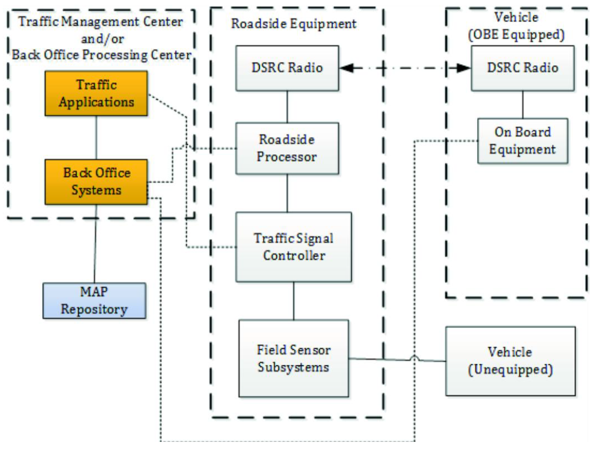

## Introduction

ISO/TS 19091 (hereinafter referred to as "this document") describes the use cases for several applications in the domain of signalized intersections, the goal of which is to improve safety, mobility, and environmental sustainability. For each use case, the information needs are defined that must be fulfilled through communication between vehicles and the infrastructure. In this way, the requirements for individual applications are defined, and these are subsequently mapped to data frames and data elements through which the individual requirements are fulfilled within the defined message set.

Note: This Extract presents selected chapters of the described document and retains the original chapter numbering.

## Usage

The aim of this specification is to define how the defined C-ITS message structures of types SPaT, MAP, SSM, and SRM can be used for C-ITS use cases related to signalized intersections. This document is therefore suitable for:

- C-ITS service providers as a catalogue of C-ITS use cases applicable at signalized intersections.

- Equipment manufacturers and telematics system suppliers as a technical specification defining the specific use of data frames and data elements to fulfil the requirements of individual use cases.

## Scope

This document defines the messages, data structures, and data elements to support exchanges between the roadside equipment and vehicles, specifically for SPaT, MAP, SSM, and SRM message types. The document consists of common clauses that are labelled informative and are generally applicable to all implementations and regions. These clauses also frequently contain references to other standards defining the content of other message types beyond those listed above.

Furthermore, the document contains 7 annexes, the content of which includes both the functional description of individual use cases in the domain of signalized intersections, the mapping of use case requirements to the content of individual data structures and data elements of the above message types, and also the individual regional profiles utilizing the so-called extension principle of data messages.

## Related Documents (Selection)

The following documents are referred to in the text in such a way that some or all of their content constitutes requirements of this document.

- ISO 22951, Data dictionary and message sets for preemption and prioritization signal systems for emergency and public transport vehicles (PRESTO)

- ISO 26684, Intelligent transport systems (ITS) – Cooperative intersection signal information and violation warning systems (CIWS) – Performance requirements and test procedures

- SAE J2735™: 2016, Dedicated Short Range Communications (DSRC) Message Set Dictionary

- EN 302 637-2 V1.3.2, Intelligent Transport Systems (ITS); Vehicular Communications; Basic Set of Applications; Part 2: Specification of Cooperative Awareness Basic Service

- ARIB STD-T109, 700 MHz Band Intelligent Transport Systems

- ITS FORUM RC-010, 700 MHz Band Intelligent Transport Systems – Extended Functions Guideline, published on March 15, 2012

- ETSI/TS 102 894-2 V1.2.2, Intelligent Transport Systems (ITS); Users and applications requirements; Part 2: Applications and facilities layer; common data dictionary

## 3 Terms and Definitions

The technical specification defines 52 terms. The most important include:

MAP data message (MAP) – data elements and frames comprising a message, the contents of which describe the geometry of a roadway intersection

signal phase and timing (SPaT) – a message sent from the infrastructure to C-ITS devices describing the current state of the traffic signal controller (at one or more intersections), its phases, and the relationship to possible intersection manoeuvres

signal request message (SRM) – a message sent from C-ITS devices to the infrastructure, by which a vehicle requests preferential treatment from the traffic signal controller for passage through the intersection

signal status message (SSM) – a message sent from the infrastructure to C-ITS devices, containing the details of the traffic signal controller's response to a request for preferential treatment at the intersection

roadside equipment (RSE) – equipment located at the infrastructure side that creates and transmits messages to vehicles and receives messages from vehicles for the purpose of supporting V2I and I2V applications

## 4 Abbreviated Terms

The technical specification contains 51 abbreviations. The most important include:

CV Connected Vehicle

OBE On-Board Equipment

RSE Roadside Equipment

SPaT Signal Phase and Timing

SRM Signal Request Message (J2735™)

SSM Signal Status Message (J2735™)

TSC Traffic Signal Controller

Other terms and abbreviations from the ITS domain can be found in the ITSTerminology dictionary (www.itsterminology.org), the StandardLand website (www.standardland.cz) or the OBP plataform (www.iso.org/obp).

## 5 General Description (informative)

This clause, spanning 14 pages and 5 subclauses, provides introductory explanatory information primarily relating to Annex A – the list of use cases. It describes how the use cases are divided into three areas: safety, mobility/sustainability, and priority/pre-emption for specific types of transport within the transport system. It also describes that in Annex A, the use cases are described by a set of 16 descriptive characteristics, ranging from basic identification information, through data flow sequence descriptions, to potential risks/issues.

The "Functional model" subclause describes the three basic components within V2I/I2V communications at signalized intersections, i.e. vehicle equipment, infrastructure, and traffic management, their roles and the relationships between them. Emphasis is placed primarily on communication between vehicles and the infrastructure; however, other interactions with traffic management applications etc. are described at least at a general level. A detailed analysis of these interactions is, however, outside the scope of this document.

Within the functional model, the general system architecture is also described, including the technical components with which the individual elements described above are equipped – see Figure 1 below. The functions of individual elements in this figure are described in the standard to the extent of approximately one page.

*Figure 1 – General architecture for V2I/I2V communications (Fig. 2 of the source standard)*

Furthermore, the Functional model addresses message interactions, i.e. an explanation of the broadcast principle within DSRC communications and the implications and requirements this has for message transmission (frequent repetition of the same message "over the air" instead of interactive information exchange used in TCP/IP).

In the last part of the "Functional model" subclause, entitled "Common operational assumptions", 11 primarily technical assumptions are listed and explained, which the authors of the standard considered valid during the design and description of the individual use cases. As an example, the first assumption states:

"It is assumed that all OBE equipped vehicles are broadcasting the basic safety message (BSM) or cooperative awareness message (CAM) continuously at some repetition rate that may change depending on the presence of active vehicles. Generally, a rate of 10 messages per second is assumed; however, the exact latency needed for the use cases has yet to be determined. It is likely that a rate of less than 10 Hz will be sufficient for these applications."

In subclauses 5.3 to 5.5, the groups of use cases into which the authors of the standard have divided them are further described in general terms, namely:

- Safety use cases

- Mobility/sustainability use cases

- Priority/pre-emption use cases

In this division, the individual use cases are also described in detail in Annex A. For each of the above groups, this subclause describes the intent (what problem the given group of use cases targets), specific assumptions beyond those stated in the preceding subclause, and architecture implications as also described in the preceding subclause.

## 6 Function Description (informative)

This clause, spanning 18 pages, describes the functional requirements divided by individual components (e.g. devices) or messages and their parts that are involved in the process of information exchange between the infrastructure (RSE) and the vehicle (OBE) within the defined use cases. The individual requirements are described in the extent of one to two short paragraphs and are subsequently mapped to use cases in Annex B.

The requirements are divided into the following subclauses:

- Public safety vehicle

- Signal pre-emption

- Public transport and commercial vehicle

- Signal priority requirements

- Broadcast area's geometrics

- Broadcast GNSS augmentation details

- Signalized intersection requirements

- Broadcast cross traffic sensor information

- Broadcast vulnerable road user sensor information

- Broadcast dilemma zone violation warning

- Broadcast signal preferential treatment status

- Message identifier

- System performance requirements

- Transmission rates — Signal preferential treatment

- Transmission rate requirements — Broadcast roadway geometrics information

- Transmission rate requirements — GNSS augmentations detail broadcasts

- Transmission rate requirements — Broadcast signal phase and timing information

- Transmission rate requirements — Broadcast cross traffic sensor information

- Transmission rate requirements — Broadcast vulnerable road user sensor information

## 7 Messages

In this very brief clause, the following is literally stated:

"This document specifies the data dictionary to be used internationally for the deployment of the following messages:

- map data (MAP);

- signal phase and timing (SPaT);

- signal request message (SRM);

- signal status message (SSM).

The structure of these messages is defined by selection of an annex and the message requirements therein. The annexes with message structure requirements are as follows:

- Annex E Profile A for J2735™;

- Annex F Profile B for J2735™;

- Annex G Profile C for J2735™."

## 8 Conformance

This brief clause defines in 3 points the conditions under which a specific implementation of C-ITS systems may be considered conformant with this document.

## Annex A (informative) Use Cases

This annex is the key content of this document, as it contains detailed descriptions of individual use cases. On the introductory page of this annex, a list is provided in a clear tabular form, from which it can be seen that the annex contains descriptions of a total of 25 use cases, divided according to the groups defined in Clause 5 of this document.

What follows is the detailed description of each use case, which also takes the form of a table with the following parts/rows:

- Use case name

- Category – according to the classification in Clause 5

- Infrastructure role – describes the role of the infrastructure in the given use case

- Short description – typically one sentence

- Goal – what is the objective of the given use case

- Constraints – recorded technical, organizational, or other constraints

- Geographic scope – whether it concerns a single intersection or an entire area

- Actors – e.g. public transport vehicle, roadside equipment, etc.

- Illustration – a clear graphical diagram including all actors and data flows

- Preconditions – must be met before the given use case can begin

- Main flow – a sequence of steps on the part of individual actors within the given use case

- Alternative flow – a sequence of steps in an alternative scenario. Some use cases have multiple alternative scenarios

- Post-conditions – description of steps that need to be taken to end the given use case and return to normal state/operation

- Information requirements – enumerates the specific data elements and data frames of C-ITS message types SPaT, MAP, SRM, SSM, and BSM/CAM needed to realize the given use case

- Issues – describes known issues with the realization of the given use case. Thematically similar to "constraints" above

## Annex B (informative) Use Case to Requirements Traceability

The content of this annex is a tabular mapping of functional requirements defined in Clause 6 of this document to the use cases described in detail in Annex A. The annex contains 3 main tables/matrices corresponding to the use case groups per Clause 5, where the rows list functional requirements from Clause 6 and the columns list use cases from Annex A. Within each matrix, it is indicated whether the respective functional requirement is mandatory (M), optional (O), conditional (C), not applicable (N/A), mandatory only in some regions (REG), or prohibited (X) for the given use case.

## Annex C (informative) Requirements Traceability Matrix

This annex defines the relationship between functional requirements defined in Clause 6 of this document and specific data frames and data elements in various types of C-ITS messages. In tabular form, for each defined functional requirement, the specific content of the C-ITS message is defined by which the given requirement can be fulfilled.

## Annex D (normative) Extension Procedures

This annex briefly explains in half a page that the SAE J2735™ data dictionary is designed with a mechanism for extending messages for local (i.e. regional) needs, and that this mechanism is described in more detail in the SAE J2735™ standard itself.

## Annexes E + F + G (normative) Profile A, Profile B, Profile C for J2735™

These annexes define the individual profiles for different regions. The profiles essentially define which use cases (see Annex A), requirements (Clause 6), and their mappings to data frames and data elements (Annex C) are applicable in the given regions. If any extensions to individual C-ITS message types (see Annex D) are used in the given region, these extensions are specified here. This document contains 3 profiles corresponding to 3 annexes:

- Profile A (used primarily in the USA, note by the extract author)

- Profile B (used primarily in Japan, note by the extract author)

- Profile C (used primarily in Europe, note by the extract author) – uses data elements from ETSI/TS 102 894-2
