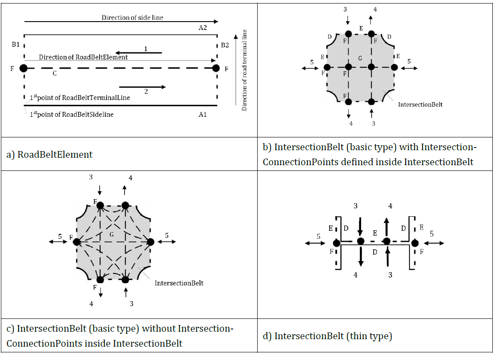
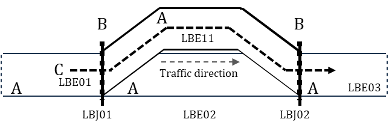

## Introduction

The ISO/TS 22726 series was created in response to the need to unify the way **static map data for automated driving (ADS)** are represented and stored. Modern vehicles with a high degree of automation require extremely precise, consistent, and rapidly accessible map data that link detailed descriptions of infrastructure with dynamic traffic information. Existing standards — such as ISO 14296 or GDF 5.1 - cover navigation or data exchange between providers, but they are not optimized for **runtime access in onboard systems** nor for representing detailed elements such as lanes, their topology, precise geometries, or relationships to traffic events.

ISO/TS 22726-1 therefore defines the logical data model and database structure for storing and directly querying detailed static map entities. ISO/TS 22726-2 builds on this model and specifies physical data structures and implementation rules so that the model can be deployed in databases used by vehicles, backends and map service providers. Together, they form the foundational framework for the next generation of high-precision maps for automated driving.

This Extract describes Part 1 of the standard (hereinafter “the described document”).

*Note: This Extract presents selected chapters of the described document and retains the original chapter numbering.*

## Use

This standard is intended for map providers, vehicle manufacturers, ADS function suppliers and C-ITS service operators. It enables a unified method for storing and updating detailed map layers, reducing maintenance costs, and ensuring interoperability across suppliers. Vehicle manufacturers use it when integrating map libraries, where fast and deterministic access to data and clear relationships between static and dynamic information are essential.

This standard is applied in the creation of HD maps, updating map layers, validating fleet sensor data, trajectory planning or integrating traffic events into map bases. The result is a unified environment that supports safe and reliable automated driving across the mobility ecosystem.

## Scope

The described document specifies the architecture and logical data model of static map data (MHAD) for ADS. It defines the main packages, their elements, common data classes, rules for the position and geometry of elements, modelling of traffic regulations and conformance requirements (see Annex A).

## Related Documents (Selection)

The described document lists one normative reference **ISO/IEC 19501** UML version 1.4.2

## 3 Terms and Definitions

The clause contains 11 terms and definitions, the most important of which are:

**feature** – database representation of a real-world object

**belt** – configuration concept for defining an area bounded by side lines and terminal lines, characterized by directions, and represented by one or more linear axes when skeletonized

The following terms are also used in the standard and in the extract:

**package** – logical unit of the model that groups related data elements into a single whole and defines their shared namespace

**subpackage** – package hierarchically placed inside another package, used for finer structuring of its content

## 4 Abbreviations

This clause lists 33 abbreviations, the most important of which are:

**ADS** automated driving system

**MHAD** map for highly automated driving

**RBE** RoadBeltElement

**LBE** LaneBeltElement

**RSE** RoadStructuresAndEquipment

Other terms and abbreviations from the ITS domain can be found in the *ITS Terminology* dictionary ([www.itsterminology.org](http://www.itsterminology.org)), the *StandardLand* website ([www.standardland.cz](http://www.standardland.cz)) or the *OBP platform* ([www.iso.org/obp](http://www.iso.org/obp)).

## 5 Document structure and conformance

This clause, 2 pages in length, refers to the main parts of the document and sets the requirements for conformance of implementations with this standard and for conformance of UML diagrams with ISO/IEC 19501.

## 6 Architecture

This clause, 1.5 pages long and containing one diagram, presents the conceptual architecture of an ITS station for ADS with various application modules (e.g. localization module, driving control module). It defines MHAD as the primary static source, with dynamic data complementing the current state of the environment and capable of updating MHAD.

## 7 Logical data model of map data

This clause, 2 pages long, shows a general data model derived from ISO 14296 and the extension of the Transportation package with MHAD. It identifies the main packages (AddressLocation, Cartographic, Service&POI, Transportation, DynamicInformation) of the overall map data model and shows, in a diagram, the relationships between them and MHAD as part of the Transportation package.

The diagram shows the structure of the Transportation package with MHAD components including RoadBeltNetwork, LaneBeltNetwork and RoadStructureAndEquipment, their relationships to RoadNetwork and TransferZoneNetwork and other networks, and specifies in which standards these network components are defined.

## 8 MHAD package

This overview clause, four pages long, defines the key concepts and configuration of the MHAD package. It identifies the subpackages of the MHAD package: RoadStructureAndEquipment, RoadBeltNetwork, LaneBeltNetwork and the shared package MHADCommonProperty, and shows their interdependencies in a class diagram.

It describes the belt concept for roads, intersections and lanes as an area element defined by direction, width and side and terminal boundaries (lines), and shows two examples.

It describes the relationships between road features and road structure, and equipment features and shows, in a diagram, how road structure and equipment elements (bridge, guardrail) are assigned to road features (road belt) using anchor positions and projection points/lines. It defines, in a table, the composition of the MHAD class and its relationship with the subpackages.

**Figure 1 – Example of the relationship between a road belt (A) with a bridge (B) and a guardrail (C) using anchor positions (1) and projection points (2) and projection lines (3) (Fig. 7 of the source standard)**

## 9 MHADCommonProperty package

This clause, 75 pages in length, describes the **MHADCommonProperty** package, which defines the common data classes and relationships used within the MHAD data model. The package is divided into three main subpackages **GeneralCommonProperty, CommonPhysicalCharacteristics and TrafficRegulation**, described in separate subclauses. Each subpackage contains a class diagram and detailed descriptions of each class.

The detailed class descriptions (in tabular form) include:

- the class definition, whether it is abstract, its parent type and stereotype,

- class attributes with their definitions, value types, multiplicities, and stereotypes,

- relationships with other classes, including definition, relationship type, multiplicity, and stereotype.

The stereotype of an attribute may be a primitive type (a Boolean value), another complex class, or a class containing only an enumeration of values. An example of a tabular class definition for the class VerticalGradient from the CommonPhysicalCharacteristics package is shown in the following table.

**Table 1 – Definition of the class VerticalGradient (Tab. 32 of the source standard)**

<table>
  <tr>
    <th colspan="3">Class: VerticalGradient</th>
  </tr>
  <tr>
    <td colspan="3">Definition: Segment of a vertical alignment that element has a single longitudinal gradient ratio.</td>
  </tr>
  <tr>
    <td colspan="3">Subtype of: VerticalAlignmentElement</td>
  </tr>
  <tr>
    <td colspan="3">Stereotypes: «DataType»</td>
  </tr>
  <tr>
    <td colspan="3">Attribute: gradientRatioValue</td>
  </tr>
  <tr>
    <td rowspan="4"></td>
    <td>Definition:</td>
    <td>Longitudinal slope ratio as a percentage where the value is positive for ascending cases and negative for descending cases. Example: value = +5.000%</td>
  </tr>
  <tr>
    <td>Value type:</td>
    <td>Decimal</td>
  </tr>
  <tr>
    <td>Multiplicity:</td>
    <td>1</td>
  </tr>
  <tr>
    <td>Stereotypes:</td>
    <td>«PrimitiveType»</td>
  </tr>
  <tr>
    <td colspan="3">NOTE This class inherits the attributes a sequentialNumber, a startPoint, and an endPoint from the attributes of the vertical alignment element superclass.</td>
  </tr>
</table>

The TrafficRegulation package is the most extensive one; in addition, it defines the methodology for modelling traffic regulations, including the ability to describe time‑based and vehicle‑based conditions (defined as the TimeCondition and VehicleCondition subpackages), as well as the main objects for defining permanent and temporary regulations.

TrafficRegulation is linked to belt features and manoeuvre trajectories at the lane or road level to enforce traffic regulations (turn prohibitions, time‑limited restrictions, conditional permissions, etc.).

## 10 RoadBeltNetwork package

This clause, spanning 61 pages, describes the model of the **road belt network**. RoadBeltNetwork consists of the following subpackages: **RoadBeltNetworkFeature**, **RoadBeltFeatureProperty**, and **RoadBeltSegmentProperty**. It defines the class diagram of this package and the detailed rules for modelling the RoadBeltNetwork, that is, how the classes describing intersections, manoeuvre trajectories at the road level, and the elements and segments of the road belt are constructed and interconnected, including examples.

The individual classes contained in the package are described in a manner similar to Clause 9.

**Figure 2 – Diagram of RoadBeltElement and IntersectionBelt (Fig. 16 of the source standard)**

## 11 LaneBeltNetwork package

This clause, spanning 35 pages, describes the model of **lane belt networks**. LaneBeltNetwork models the lane-level structure with an analogous structure to the road-level model, but with higher granularity. It consists of the following subpackages: **LaneBeltNetworkFeature**, **LaneBeltFeatureProperty**, and **LaneBeltSegmentProperty**. It defines the class diagram of this package and the detailed rules for modelling the LaneBeltNetwork, that is, how the classes describing the elements and connections of the lane belt are constructed and interconnected, and how manoeuvre trajectories at the lane level are modelled.

**Figure 3– Example of a lane-level manoeuvre trajectory (C) containing lane belt elements (A) and their connections (B) (Fig. 23 of the source standard)**

## 12 RoadStructureAndEquipment package

This clause, spanning 99 pages, describes the model of road structures and road equipment, including horizontal road markings.

RoadStructureAndEquipment consists of the following subpackages: RoadEquipment, RoadMarking, RoadStructure, and RSECommonProperty.

It defines the list of elements (see the example in the following table) and indicates to which preceding network concept they belong.

**Table 2 – Excerpt from Tab. 172 of the source standard: Overview of RSE categories**

<table>
  <tr>
    <th>Category</th>
    <th>Example element</th>
    <th>Note</th>
  </tr>
  <tr>
    <td>Road Structure</td>
    <td>central reserve (CentralReserve); tunnel (Tunnel); road bridge (VehicleBridge)</td>
    <td></td>
  </tr>
  <tr>
    <td>Road Equipment</td>
    <td>vertical traffic sign (RoadSign); traffic pole (TrafficPole); guardrail (Guardrail)</td>
    <td></td>
  </tr>
  <tr>
    <td>Road Marking</td>
    <td>stop line (StopLine); pedestrian crossing (PedestrianCrossing); longitudinal marking (LaneEdgeMarking)</td>
    <td></td>
  </tr>
</table>

At the level of each subpackage, the clause contains a class diagram and a detailed description of the individual classes. The classes contained in the package are described in a manner like Clause 9.

## 13 Relationship between MHAD and dynamic information

This clause, in two sentences, notes that dynamic information defined in TS 22726-2 may refine MHAD through the **RoadNetworkElement** interface and refers to the diagram in Clause 9.2.

## Annex A (normative) – Abstract test suite

This annex, one page in length, lists the test items for verifying data structures in bullet form and refers to Clause 7.

## Annex B (informative) – Basic data types and stereotypes

This annex, 1.5 pages long, provides a table containing the definitions and source standards of primitive data types (number, string, etc.) and stereotypes (weight, speed, time, linear and point data, etc.) taken from other standards.

## Annex C (informative) – Resolution and accuracy of MHAD

This annex, one page long, provides recommended resolution and metrics for positional data (GNSS/RTK), tolerances, and methodologies for accuracy validation.

## Annex D (informative) – Comparison of road network models

This annex, five pages long, compares the MHAD belt model with traditional linear models (ISO/TS 20452, ISO 14296, GDF/ISO 20524-2) and includes recommendations for transformations and interoperability.
