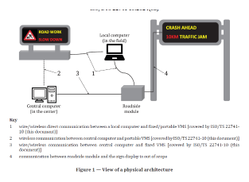
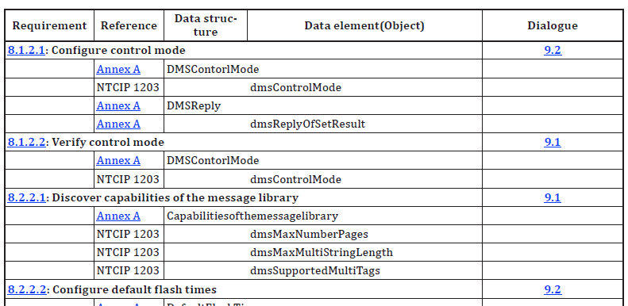

## Introduction

The ISO 22741-10 standard (hereinafter referred to as 'the described document') is part of a set of standards that define the principles of information exchange between infrastructure devices and traffic centres using AP-DATEX (an application profile of DATEX II, which serves for the exchange of traffic data between various information systems).

The described document focuses on defining the requirements for the format and method of bidirectional data exchange between Variable Message Signs (hereinafter VMS) and the traffic center in real time, thus enabling effective and efficient traffic management on the communication network.

The aim of the described document is to establish user requirements for the display area of VMS devices, especially requirements for reliability, specification, and technical condition of the devices.

*Note: This Extract presents selected chapters of the described document and retains the original chapter numbering.*

## Usage

The described document is intended primarily for manufacturers and suppliers of ITS components on infrastructure, as well as for contracting authorities and investors, to ensure that supplied devices will be compatible and harmonized within the entire ITS system, which should be required in the technical conditions of tenders for the supply and installation of these devices and require suppliers to demonstrate compliance.

## Scope

The described document defines the basic user requirements for the display parts of VMS (i.e., LED matrices) to ensure interoperability between different VMS manufacturers in relation to the superior control system.

## Related Documents (Selection)

The standard refers to only one related document: ISO 22741-1, Intelligent Transport Systems — Roadside modules AP-DATEX data interface — Part 1: Overview

## 3 Terms and Definitions

The described document refers to the terms listed in ISO 22741-1 and the ISO and IEC terminology database. There are 5 terms defined, the most important of which are the following:

**centre system** – intelligent transport systems (ITS) component that provides application, management and/or administrative functions from a centralized location (i.e. not at the roadside)

**message** – data concept consisting of a grouping of data elements, data frames, or data elements and data frames, that is used to convey a complete set of information

**traffic management system** –centre system that monitors and controls traffic and the road network

**variable message sign (VMS) –** field device that can display real-time traveller information to the public

## 4 Abbreviations

This clause defines ten abbreviations, the most important of which are the following:

**AP-DATEX** Application profile of DATEX II, used for the exchange of traffic data between various information systems

**VMS** Variable Message Sign, which allows setting variable traffic symbols and information according to the current traffic situation

Other terms and abbreviations from the ITS domain can be found in the *ITSTerminology* dictionary (), the *StandardLand* website () or the *OBP plataform* ().

## 5 Conformance

The chapter presents two tables with references to the conditions for demonstrating compliance, referring to standard 22741-1.

*Table 1 defines user needs and the obligation to demonstrate their compliance (O = Optional, M = Mandatory).*

**Table 1 — User need to feature conformance (Tab. 1 of the source standard)**

<table>
  <tr>
    <th colspan="2">User needs defined in this document</th>
  </tr>
  <tr>
    <td>7.2: Manage the sign display</td>
    <td>M</td>
  </tr>
  <tr>
    <td>8.2: Message library</td>
    <td>M</td>
  </tr>
  <tr>
    <td>8.3: Sign display</td>
    <td>M</td>
  </tr>
  <tr>
    <td>8.7: Sign display light sensors</td>
    <td>M</td>
  </tr>
  <tr>
    <td>8.8: Sign display pixels</td>
    <td>O</td>
  </tr>
</table>

## 6 Physical Architecture

The chapter contains a description of the physical arrangement of the VMS device itself. A general description of the system is given, also in relation to superior control (central system or locally via computer).

**Figure 1 – View of y physical architecture (Fig. 1 of the source standard)**

## 7 User Needs

The chapter describes in detail each of the 5 user requirements: Management of VMS control mode,

- **Management of VMS control mode**: Must allow changing the method of control and management of VMS (local, remote from the center, combined with priority from the center)

- **Management of VMS display part**: Must allow monitoring and changing displayed symbols, texts on VMS

- **Monitoring of the VMS door part**: Must provide information about the opening/closing of the VMS cabinet door

- **Monitoring of mains power supply**: Must provide information about the status of mains power supply

- **Monitoring of power supply status**: Must provide information about the method of VMS power supply (from mains, from batteries)

## 8 Requirements

The chapter describes in more detail the requirements for VMS properties, including LED matrix definition, data exchange requirements, and reliability of individual LEDs.

Example structure of Chapter 8.8:

- **8.8.1 – Definition of LED matrix** (monitors the current status of each LED in the matrix)

- **8.8.2 – Data exchange requirements** (provides information about pixel size, LED pitch, must allow diagnostics to determine faulty LEDs)

- **8.8.3 – Reliability of individual LEDs in the matrix** (the device must monitor each LED in the matrix, each LED must ensure display in 16,777,216 colors of the RGB spectrum)

## 9 Dialogues

A short chapter on half a page defines communication between VMS and the client (center/local computer) for processes: Reading data from VMS and Writing data to VMS. In both processes, the chapter refers to the already mentioned standard 22741-1.

## Annex A (Normative) – Data packet structures

Illustrates on 7 pages the data format for information exchange between the canter and VMS in ASN.1 format, referring to standard 15784-3.

## Annex B (Normative) – Requirements traceability matrix (RTM)

The annex on 5 pages provides references to NTCIP 1203 standards.

It is Table B.1, a small sample of which is given below.

In the complete table of the described document, further requirements and references to specific chapters follow.

**Table 2 – Excerpt of the Requirements traceability matrix table (Tab. B.1 of the source standard)**

