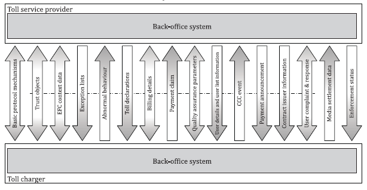

## Introduction

This technical standard (hereinafter also referred to as the "described document") specifies the interface for the exchange of data messages between the main entities (roles) of the electronic fee collection system architecture, i.e. the toll charger and the toll service provider. It establishes the complete specification of application protocol data units (APDUs), application data units (ADUs), their syntax, semantics and transfer mechanisms supporting interoperability between the back-office systems of toll chargers and toll service providers.

*Note: This Extract presents selected chapters of the described document and retains the original chapter numbering.*

## Usage

The described document is intended for toll chargers and toll service providers, as it establishes the basic elements of mutual interoperability at the level of their back-end systems. The document is applicable to vehicle-related toll services including road user charging, parking and access control, independently of the charging technology used.

## Scope

The described document defines the exchange of information between the toll charger and the toll service provider. It describes the interface functionality, as well as the complete syntax and semantics of the data messages that can be exchanged via the interface (especially trusted objects, context data, exception lists, toll declarations, billing details, enforcement data). Furthermore, transmission mechanisms and support functions are described here.

## Related documents (selection)

The described document refers to more than 20 technical standards, the most important of which are:

ISO 14906 — Electronic fee collection — Application interface definition for dedicated short-range communication

ISO/TS 17573-2 — Electronic fee collection — System architecture for vehicle-related tolling — Part 2: Vocabulary

ISO 17573-3 — Electronic fee collection — System architecture for vehicle-related tolling — Part 3: Data dictionary

ISO 12813 — Compliance check communication for autonomous systems

ISO 13141 — Localization augmentation communication for autonomous systems

ISO 19299 — Electronic fee collection — Security framework

## 3 Terms and definitions

This clause does not introduce additional terms and definitions. For the purposes of this document, the terms and definitions given in ISO/TS 17573-2 apply.

## 4 Abbreviations

This clause contains more than 40 abbreviations related to the described document, the most important of which are the following:

**ADU** - application data unit

**DSRC** - dedicated short-range communications

**EFC** - electronic fee collection system; electronic fee collection

**GNSS** - global navigation satellite system

**OBE** - on-board equipment

**RSE** - roadside equipment

**TC** - toll charger

**TSP** - toll service provider

NOTE: Other terms and abbreviations from the ITS domain can be found in the ITSTerminology dictionary ([www.itsterminology.org](http://www.itsterminology.org/)*)*, the StandardLand website ([www.standardland.cz](http://www.standardland.cz/)) or the OBP platform ([www.iso.org/obp](http://www.iso.org/obp)*).*

## 5 Architectural concepts and information exchanges

This clause, spanning 10 pages, contains a basic description of the interface functionalities for the exchange of data messages between the toll charger and the toll service provider. The architecture is based on the reference architecture defined in ISO 17573-1 and specifies the information exchanges between the two back-office roles. The following functionalities are described:

- exchange of trust objects;
- provision of EFC context data;
- management of exception lists;
- reporting of abnormal behavior;
- reporting of toll declarations;
- reporting of billing details;
- reporting of payment claims;
- exchange of quality assurance parameters;
- reporting of CCC events;
- provision of user details and user lists;
- reporting of payment announcements;
- provision of contract issuer information;
- processing of user complaints;
- provision of media settlement data;
- reporting of enforcement status.

{.figure}

/// caption
Figure 1 – Overview of functionalities (Fig. 3 of the source standard)
///

## 6 Computational specification

This clause, spanning 256 pages, contains a description of the structure of 19 application data units (ADUs) that form the data messages transmitted via the interface. This is the pivotal clause of the described document. The ADUs listed in the table below are defined sequentially.

<table border="1" cellspacing="0" cellpadding="6" style="border-collapse: collapse; width: 100%;">
<thead>
<tr>
<th style="border: 1px solid black;">Functionality</th>
<th style="border: 1px solid black;">ADU type name</th>
<th style="border: 1px solid black;">Description</th>
</tr>
</thead>
<tbody>
<tr>
<td style="border: 1px solid black;" rowspan="3">Basic protocol mechanisms (see 5.2.2)</td>
<td style="border: 1px solid black;"><code>RequestAdu</code> (see 6.4)</td>
<td style="border: 1px solid black;">Request to send ADUs from TC or TSP</td>
</tr>
<tr>
<td style="border: 1px solid black;"><code>AckAdu</code> (see 6.5)</td>
<td style="border: 1px solid black;">Acknowledgement of received ADUs by TC or TSP</td>
</tr>
<tr>
<td style="border: 1px solid black;"><code>StatusAdu</code> (see 6.6)</td>
<td style="border: 1px solid black;">Provide a generic status information to TC or TSP</td>
</tr>
<tr>
<td style="border: 1px solid black;">Exchange trust objects (see 5.2.3)</td>
<td style="border: 1px solid black;"><code>TrustObjectAdu</code> (see 6.7)</td>
<td style="border: 1px solid black;">Exchange keys and certificates between TC and TSP</td>
</tr>
<tr>
<td style="border: 1px solid black;">Originate EFC context data (see 5.2.4)</td>
<td style="border: 1px solid black;"><code>EfcContextDataAdu</code> (see 6.8)</td>
<td style="border: 1px solid black;">Send a formal description of the TC's toll domain from TC to TSP or information about the TSP from the TSP to the TC</td>
</tr>
<tr>
<td style="border: 1px solid black;">Manage exception lists (see 5.2.5)</td>
<td style="border: 1px solid black;"><code>ExceptionListAdu</code> (see 6.9)</td>
<td style="border: 1px solid black;">Send exception list of type block list, access list or discounted user list from TSP to TC</td>
</tr>
<tr>
<td style="border: 1px solid black;">Report abnormal behaviour (see 5.2.6)</td>
<td style="border: 1px solid black;"><code>ReportAbnormalBehaviourAdu</code> (see 6.10)</td>
<td style="border: 1px solid black;">Report abnormal behaviour of an OBE or a service user from the TC to the TSP</td>
</tr>
<tr>
<td style="border: 1px solid black;">Report toll declarations (see 5.2.7)</td>
<td style="border: 1px solid black;"><code>TollDeclarationAdu</code> (see 6.11)</td>
<td style="border: 1px solid black;">Send acquired toll declarations from the TSP to the TC</td>
</tr>
<tr>
<td style="border: 1px solid black;">Report billing details (see 5.2.8)</td>
<td style="border: 1px solid black;"><code>BillingDetailsAdu</code> (see 6.12)</td>
<td style="border: 1px solid black;">Send calculated billing details either from TC to TSP or from TSP to TC</td>
</tr>
<tr>
<td style="border: 1px solid black;">Report payment claim (see 5.2.9)</td>
<td style="border: 1px solid black;"><code>PaymentClaimAdu</code> (see 6.13)</td>
<td style="border: 1px solid black;">Send a payment claim for accepted billing details from TC to TSP</td>
</tr>
<tr>
<td style="border: 1px solid black;">Exchange quality assurance parameters (see 5.2.10)</td>
<td style="border: 1px solid black;"><code>ReportQaAdu</code> (see 6.14)</td>
<td style="border: 1px solid black;">Exchange QA parameters between TC and TSP</td>
</tr>
<tr>
<td style="border: 1px solid black;">Report CCC event (see 5.2.11)</td>
<td style="border: 1px solid black;"><code>ReportCccEventAdu</code> (see 6.16)</td>
<td style="border: 1px solid black;">Report CCC event from TC to TSP</td>
</tr>
<tr>
<td style="border: 1px solid black;" rowspan="2">Provide user &amp; user list information (see 5.2.12)</td>
<td style="border: 1px solid black;"><code>ProvideUserDetailsAdu</code> (see 6.15)</td>
<td style="border: 1px solid black;">Provide details on a user or vehicle from TC to TSP</td>
</tr>
<tr>
<td style="border: 1px solid black;"><code>ProvideUserIdListAdu</code> (see 6.17)</td>
<td style="border: 1px solid black;">Provide a list of related users from TSP to TC</td>
</tr>
<tr>
<td style="border: 1px solid black;">Report payment announcement (see 5.2.13)</td>
<td style="border: 1px solid black;"><code>PaymentAnnouncementAdu</code> (see 6.18)</td>
<td style="border: 1px solid black;">Send a payment announcement for a payment from TSP to TC</td>
</tr>
<tr>
<td style="border: 1px solid black;">Provide contract issuer information (see 5.2.14)</td>
<td style="border: 1px solid black;"><code>ContractIssuerListAdu</code> (see 6.19)</td>
<td style="border: 1px solid black;">Provide information on the accepted OBE from TSP to TC</td>
</tr>
<tr>
<td style="border: 1px solid black;" rowspan="2">User complaint and response (see 5.2.15)</td>
<td style="border: 1px solid black;"><code>UserComplaintAdu</code> (see 6.20)</td>
<td style="border: 1px solid black;">Send a user complaint from TSP to TC</td>
</tr>
<tr>
<td style="border: 1px solid black;"><code>UserComplaintResponseAdu</code> (see 6.21)</td>
<td style="border: 1px solid black;">Send the result of handling a user complaint from TC to TSP</td>
</tr>
<tr>
<td style="border: 1px solid black;">Provide media settlement data (see 5.2.16)</td>
<td style="border: 1px solid black;"><code>MediaSettlementDataAdu</code> (see 6.22)</td>
<td style="border: 1px solid black;">Send media settlement data from TC to TSP</td>
</tr>
<tr>
<td style="border: 1px solid black;">Report enforcement status (see 5.2.17)</td>
<td style="border: 1px solid black;"><code>EnforcementStatusAdu</code> (see 6.23)</td>
<td style="border: 1px solid black;">Report enforcement status from TSP to TC</td>
</tr>
</tbody>
</table>

/// caption | <
Table 1 – Overview of ADUs (Tab. 8 of the source standard)
///

For illustration, the definition of the ExceptionListADU data unit is provided below.

<table border="1" cellspacing="0" cellpadding="6" style="border-collapse: collapse; width: 100%;">
<thead>
<tr>
<th style="border: 1px solid black;">Data element</th>
<th style="border: 1px solid black;">Data type/data description</th>
<th style="border: 1px solid black;">Status</th>
</tr>
</thead>
<tbody>
<tr>
<td style="border: 1px solid black;"><code>aduIdentifier</code></td>
<td style="border: 1px solid black;">
<code>AduIdentifier</code> (see description in 6.2.4) 
This data element shall contain a unique identifier for this ADU. It shall be unique for each originator specified in <code>apduOriginator</code> in the <code>apci</code> of the APDU.
</td>
<td style="border: 1px solid black;">M</td>
</tr>
<tr>
<td style="border: 1px solid black;"><code>exceptionListVersion</code></td>
<td style="border: 1px solid black;">
<code>ExceptionListVersion</code> specified as <code>INTEGER</code> ranging from 0 to 263-1 
This data element shall contain a unique version number of the exception list. The first exception list by a TSP of each <code>exceptionListType</code> shall bear the number 1 and shall be incremented with each new version by 1.
</td>
<td style="border: 1px solid black;">M</td>
</tr>
<tr>
<td style="border: 1px solid black;"><code>exceptionListType</code></td>
<td style="border: 1px solid black;">
<code>ExceptionListType</code> (see Table 218) specified as <code>INTEGER</code> ranging from 0 to 255 
This data element shall contain the type of exception list.
</td>
<td style="border: 1px solid black;">M</td>
</tr>
<tr>
<td style="border: 1px solid black;"><code>exceptionValidityStart</code></td>
<td style="border: 1px solid black;">
<code>GeneralizedTime</code> 
This data element may optionally contain a point in time in the future from which the exception list is valid.  
The exception list shall become valid immediately on processing if this data element is not provided or if it contains a time in the past.
</td>
<td style="border: 1px solid black;">O</td>
</tr>
<tr>
<td style="border: 1px solid black;"><code>exceptionValidityEnd</code></td>
<td style="border: 1px solid black;">
<code>GeneralizedTime</code> 
This data element may optionally contain a point in time in the future from which the exception list is no longer valid.  
NOTE It is not recommended to use this data element for block lists or access lists to avoid a situation where an exception list is no longer valid before a new exception list is sent and processed by the TC.
</td>
<td style="border: 1px solid black;">O</td>
</tr>
<tr>
<td style="border: 1px solid black;"><code>exceptionListEntries</code></td>
<td style="border: 1px solid black;">
List (ASN.1 SEQUENCE OF) of zero or more elements of data type <code>ExceptionListEntry</code> (see Table 219) 
This data element shall contain the TSPs exceptions. A list with zero elements means that there are no entries in the exception list. If no <code>exceptionListEntries</code> are available, the data element shall be sent with zero elements (empty list).  
A TSP may send an empty access list if it has no active user contracts for the toll context of the TC.
</td>
<td style="border: 1px solid black;">M</td>
</tr>
<tr>
<td style="border: 1px solid black;"><code>actionCode</code></td>
<td style="border: 1px solid black;">
<code>ActionCode</code> (see Table 10) 
This data element may optionally be used to indicate specific actions performed by the sender of the request. Only the values <code>send</code>, <code>resend</code> and <code>respond</code> are allowed.
</td>
<td style="border: 1px solid black;">O</td>
</tr>
<tr>
<td style="border: 1px solid black;"><code>actionRequest</code></td>
<td style="border: 1px solid black;">
<code>ActionCode</code> (see Table 11) 
This data element may optionally be used to indicate specific actions to be pursued by the receiver of the request. Only the values <code>process</code> and <code>wait</code> are allowed.
</td>
<td style="border: 1px solid black;">O</td>
</tr>
</tbody>
</table>

/// caption | <
Table 2 – Data elements of ExceptionListADU (Tab. 217 of the source standard)
///

Individual data types are explained sequentially in the text, or their definition is provided. For illustration, the definition of the ExceptionListEntry data type is provided below.

<table border="1" cellspacing="0" cellpadding="6" style="border-collapse: collapse; width: 100%;">
<thead>
<tr>
<th style="border: 1px solid black;">Data element</th>
<th style="border: 1px solid black;">Data type/data description</th>
<th style="border: 1px solid black;">Status</th>
</tr>
</thead>
<tbody>
<tr>
<td style="border: 1px solid black;"><code>userId</code></td>
<td style="border: 1px solid black;">
<code>UserId</code> (see Table 12) 
This data element shall contain the parameters of the user.
</td>
<td style="border: 1px solid black;">M</td>
</tr>
<tr>
<td style="border: 1px solid black;"><code>replacedUserId</code></td>
<td style="border: 1px solid black;">
<code>UserId</code> (see Table 12) 
This data element may optionally contain parameters of the user, that replace the parameters stated in the data element <code>userId</code>. 
EXAMPLE Change of licence plate
</td>
<td style="border: 1px solid black;">O</td>
</tr>
<tr>
<td style="border: 1px solid black;"><code>statusType</code></td>
<td style="border: 1px solid black;">
<code>ExceptionListStatusType</code> (see Table 220) specified as <code>INTEGER</code> ranging from 0 to 255 
This data element may optionally contain an additional limitation for the exception list entry.
</td>
<td style="border: 1px solid black;">O</td>
</tr>
<tr>
<td style="border: 1px solid black;"><code>reasonCode</code></td>
<td style="border: 1px solid black;">
List (ASN.1 SEQUENCE OF) of one or more elements of data type <code>ExceptionListReasonCode</code> (see Table 221) specified as <code>INTEGER</code> ranging from 0 to 255 
This data element shall contain a list of reasons for this exception list entry.
</td>
<td style="border: 1px solid black;">M</td>
</tr>
<tr>
<td style="border: 1px solid black;"><code>entryValidityStart</code></td>
<td style="border: 1px solid black;">
<code>GeneralizedTime</code> 
This data element may optionally contain a point in time in the future from which the exception list entry is valid.  
The exception list entry shall become valid immediately on processing if this data element is not provided or if it contains a time in the past.
</td>
<td style="border: 1px solid black;">O</td>
</tr>
<tr>
<td style="border: 1px solid black;"><code>entryValidityEnd</code></td>
<td style="border: 1px solid black;">
<code>GeneralizedTime</code> 
This data element may optionally contain a point in time in the future from which the exception list entry is no longer valid.  
This data element shall only be used if the data element <code>exceptionListType</code> in the <code>ExceptionListAdu</code> contains the value <code>discountedListFull</code> or <code>discountedListIncremental</code> to indicate the end of applicability of a discount for a user.
</td>
<td style="border: 1px solid black;">O</td>
</tr>
<tr>
<td style="border: 1px solid black;"><code>vehicleParameters</code></td>
<td style="border: 1px solid black;">
<code>VehicleParameters</code> (see Table 222) 
This data element may optionally contain vehicle-specific information about the vehicle indicated in data element <code>userId</code>.
</td>
<td style="border: 1px solid black;">O</td>
</tr>
<tr>
<td style="border: 1px solid black;"><code>vehicleParametersAuthenticator</code></td>
<td style="border: 1px solid black;">
<code>AuthenticatorEfc</code> (see Table 16) 
This data element may optionally contain an authenticator calculated over the content of the data element <code>vehicleParameters</code>.
</td>
<td style="border: 1px solid black;">O</td>
</tr>
<tr>
<td style="border: 1px solid black;"><code>actionRequested</code></td>
<td style="border: 1px solid black;">
<code>ExceptionListActionType</code> (see Table 223) specified as <code>INTEGER</code> ranging from 0 to 255 
This data element may optionally contain the action the TSP requests from the TC for an exception list entry.  
NOTE 1 The support of the TC for an action requested by the TSP needs to be agreed bilaterally between the TC and the TSP.
</td>
<td style="border: 1px solid black;">O</td>
</tr>
<tr>
<td style="border: 1px solid black;"><code>mediaProviderId</code></td>
<td style="border: 1px solid black;">
<code>Provider</code> (imported from ISO 17573-3) 
This data element may optionally contain an identifier of the issuer of the ICC.  
This data element shall only be stated if the data element <code>exceptionListType</code> in the <code>ExceptionListAdu</code> contains the value <code>iccListFull</code> or <code>iccListIncremental</code>.
</td>
<td style="border: 1px solid black;">O</td>
</tr>
<tr>
<td style="border: 1px solid black;"><code>applicableDiscounts</code></td>
<td style="border: 1px solid black;">
List (ASN.1 SEQUENCE OF) of one or more elements of data type <code>ApplicableDiscounts</code> (see Table 224) 
This data element may optionally contain a list of eligible discounts for the user indicated in <code>userId</code>.  
This data element shall only be stated if the data element <code>exceptionListType</code> in the <code>ExceptionListAdu</code> contains the value <code>discountedListFull</code> or <code>discountedListIncremental</code>.  
The data element shall not be sent if no discounts are applicable for the user indicated in <code>userId</code>.
</td>
<td style="border: 1px solid black;">O</td>
</tr>
<tr>
<td style="border: 1px solid black;"><code>costCentre</code></td>
<td style="border: 1px solid black;">
<code>UTF8String SIZE (1..16)</code> 
This data element may optionally contain user-related cost centre information to be stated in the billing details.
</td>
<td style="border: 1px solid black;">O</td>
</tr>
<tr>
<td style="border: 1px solid black;"><code>identificationType</code></td>
<td style="border: 1px solid black;">
<code>IdentificationType</code> (see Table 225) specified as <code>INTEGER</code> ranging from 0 to 255 
This data element may optionally contain information about the device provided to the user by the TSP for means of identification.  
NOTE 2 It can be used as a fall-back method to identify the user by the TC.
</td>
<td style="border: 1px solid black;">O</td>
</tr>
</tbody>
</table>

/// caption | <
Table 3 – Data elements of ExceptionListEntry (Tab. 219 of the source standard)
///

## 7 Transfer mechanisms and supporting functions

This clause, spanning 3 pages, establishes recommendations regarding the use of a secure communication channel, data encoding, message authentication, and message signing algorithms.

## Annex A (normative) – Data type specifications

Annex A, spanning 1 page, provides the specification of the data types used according to ASN.1. A reference is provided here to the relevant ASN files, which can be imported into other application modules.

## Annex B (informative) – Example enforcement process applying standardized APDU exchanges

Annex B, spanning 5 pages, describes the enforcement process. The process is illustrated using an activity diagram capturing the steps implemented on the side of the toll charger and the toll service provider, as well as the exchanged data messages.

## Annex C (informative) – Example of data flows in a toll domain

Annex C, spanning 3 pages, describes an example of a data flow in a toll domain. The example is illustrated using a sequence diagram capturing the data exchange between the toll charger, on-board equipment (OBE), toll ser-vice provider, and user.

## Annex D (informative) – Example of rounding differences

Annex D, spanning 4 pages, illustrates using the EasyGo example how rounding of amounts from aggregated toll transactions can be approached when creating billing details.

## Annex E (informative) – Fee calculation using EFC context data

Annex E, spanning 4 pages, provides an example of toll calculation based on tariff table information, toll context information, and toll domain usage information.
